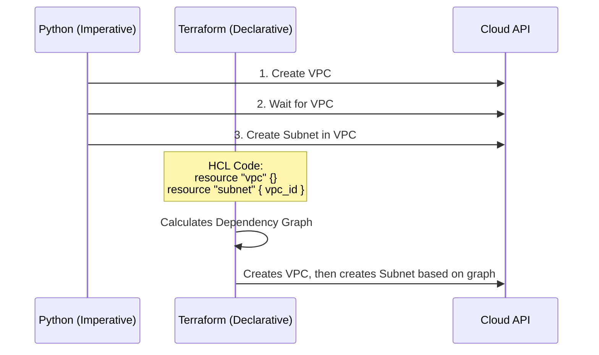

Part2 and 3 combined notes: I will now combine the notes from the previous response with additional details from this final video part, adding more diagrams and interview questions.

### **To-the-Point Summary**

The final segment of the training session focuses on reinforcing the block structure in Terraform and applying it practically. The trainer emphasizes that HCL (HashiCorp Configuration Language) is completely block-oriented, contrasting it with traditional line-by-line scripting languages like C or Python. Through repetition, the concept is solidified: everything in Terraform is either a block or an argument within a block. The session walks through writing the `terraform {}` block with a nested `required_providers {}` block, specifically configuring the `azurerm` provider. It highlights the mandatory nature of the `features {}` block within the Azure provider configuration. The core takeaway is that mastering the block syntax (zero, one, or two labels) and understanding how to read documentation are the keys to writing Terraform code for any provider.

---

### **Detailed Notes: Advanced Block Structure and Provider Configuration**

**1. HCL vs. Traditional Scripting**

* Traditional programming languages (C, C++, Java, Python) execute code line-by-line.
* Terraform's HCL is strictly "Block-by-Block." You define chunks of configuration rather than sequential steps.
* *Key Concept:* In HCL, "ARGUMENT khud bhi ek block ho sakta hai" (An argument itself can be a block).

**2. Practical Implementation: The Azure Provider**
The trainer demonstrates building the foundation for an Azure deployment.

* **Step 1: The Terraform Block**
* This is a zero-label block: `terraform { ... }`
* It defines the required core behavior for Terraform itself.


* **Step 2: The Required Providers Block**
* This is a nested block (an argument inside the `terraform` block): `required_providers { ... }`
* Inside, you define the specific provider and its source/version.
* Example:
```hcl
azurerm = {
  source  = "hashicorp/azurerm"
  version = "4.65.0"
}

```


* **Step 3: The Provider Block**
* This is a one-label block: `provider "azurerm" { ... }`
* It configures the settings for the provider declared earlier.
* **Crucial Azure Detail:** For the `azurerm` provider, the `features {}` block is mandatory inside the provider block, even if it is left completely empty. Without it, Terraform will throw an error during initialization or planning.


**Code Snippet: Core Azure Setup (from session)**

```hcl
terraform {
  required_providers {
    azurerm = {
      source  = "hashicorp/azurerm"
      version = "4.65.0"
    }
  }
}

provider "azurerm" {
  # Configuration options
  features {} # Mandatory for Azure
}

resource "azurerm_resource_group" "example" {
  name     = "example"
  location = "West Europe"
}

```

**3. Visualizing the Architecture**
The trainer uses a whiteboard approach to solidify the mental model of the three block types.

**HLD/LLD Diagram 1: The Block Taxonomy**

```mermaid
graph TD
    A[Terraform HCL Structure] --> B[Zero Labels]
    A --> C[One Label]
    A --> D[Two Labels]
    
    B --> B1[Syntax: Block_Name { } ]
    B1 --> B2[Example: terraform { }]
    
    C --> C1[Syntax: Block_Name \"label\" { }]
    C1 --> C2[Example: provider \"azurerm\" { }]
    
    D --> D1[Syntax: Block_Name \"label1\" \"label2\" { }]
    D1 --> D2[Example: resource \"azurerm_resource_group\" \"example\" { }]

```

---

### **Extended Interview Questions Sections**

**Q13. In Azure Terraform configurations, what is the significance of the `features {}` block, and where must it be placed? (Discussed by Trainer)**
**Answer:**
The `features {}` block is a mandatory nested block required by the `azurerm` provider. It must be placed inside the `provider "azurerm" {}` block. Even if you are not enabling any specific optional features, the block must be present (often empty as `features {}`), otherwise Terraform operations will fail.

**Q14. How does Terraform's execution model differ from a script written in Python or Bash? (Discussed by Trainer)**
**Answer:**
Scripts in Python or Bash are imperative; they execute commands sequentially, line-by-line. Terraform uses HCL, which is declarative. You define the desired end-state using a "Block-by-Block" structure, and Terraform determines the sequence of API calls required to reach that state.

**HLD/LLD Diagram 2: Imperative vs. Declarative**



---

### **L2 & L3 Advanced Interview Questions (Continued)**

*(Source: Internet)*

**Q15. Explain the concept of the Terraform Dependency Graph. How does Terraform know what order to create resources in? (Asked at: VMware) - **Important****
**Answer:**
Terraform automatically builds a directed acyclic graph (DAG) to map dependencies between resources. If `Resource B` references an attribute exported by `Resource A` (e.g., `subnet` referencing `vpc.id`), Terraform draws an edge from A to B. It then traverses this graph to ensure `Resource A` is created before `Resource B`. If there are no dependencies, Terraform creates resources in parallel. You can force a dependency using the `depends_on` meta-argument if implicit dependencies are not enough.

**HLD/LLD Diagram 3: Terraform Dependency Graph (DAG)**

```mermaid
graph LR
    A[VPC Creation] -->|Exports ID| B[Subnet Creation]
    A -->|Exports ID| C[Security Group Creation]
    B -->|Exports ID| D[EC2 Instance Creation]
    C -->|Exports ID| D
    Note right of D: EC2 waits for both<br>Subnet and SG to finish

```

Q16. What is a Terraform Provider, and how does it interact with the core Terraform binary? (Asked at: Red Hat) 
**Answer:**
A provider is a logical abstraction of an upstream API (like AWS, Azure, or Datadog). The core Terraform binary (written in Go) parses the HCL and builds the dependency graph, but it doesn't know how to create cloud resources. It uses RPC (Remote Procedure Calls) over gRPC to communicate with the Provider plugin. The Provider translates the HCL configuration into specific REST API calls understood by the target cloud platform.

**Q17. How do you handle multi-region deployments in Terraform using a single configuration directory? (Asked at: Capgemini) - **Important****
**Answer:**
You handle multi-region deployments by declaring multiple `provider` blocks for the same cloud provider, but assigning an `alias` to the secondary ones. When defining a resource in the secondary region, you use the `provider` meta-argument to reference the specific alias.

**Code Snippet: Multi-Region Setup**

```hcl
# Default Provider (e.g., us-east-1)
provider "aws" {
  region = "us-east-1"
}

# Aliased Provider for secondary region
provider "aws" {
  alias  = "west"
  region = "us-west-2"
}

# Resource in default region
resource "aws_vpc" "main" {
  cidr_block = "10.0.0.0/16"
}

# Resource in secondary region
resource "aws_vpc" "dr_site" {
  provider   = aws.west
  cidr_block = "10.1.0.0/16"
}

```

Q18. What is the `null_resource` and when might you use it? (Asked at: Wipro) 
**Answer:**
The `null_resource` implements the standard resource lifecycle but takes no further action. It is primarily used as a hook or trigger to execute local scripts (using `local-exec` provisioners) or remote scripts (`remote-exec`) when certain variables or state changes occur, often tying them together with `depends_on` or `triggers` arguments without creating physical infrastructure.

Q19. Describe the difference between `terraform refresh` and `terraform plan`. (Asked at: HCLTech) 
**Answer:**

* `terraform refresh` reads the current state of physical infrastructure and updates the local state file to match it, but it *does not* compare it against your HCL code or suggest changes. (Note: `refresh` is largely deprecated as a standalone command and is now implicitly run during `plan`).
* `terraform plan` does three things: it refreshes the state, compares the updated state against your HCL configuration, and outputs an execution plan detailing exactly what will be added, changed, or destroyed to make the real world match your code.

Q20. If you accidentally delete the `.terraform` directory and the `.terraform.lock.hcl` file, what happens and how do you recover? (Asked at: Mindtree) 
**Answer:**
The `.terraform` directory contains the downloaded provider plugins and initialized backend configuration. The `.terraform.lock.hcl` file records the exact hashes of the provider versions you were using. If deleted, you cannot run `plan` or `apply`. To recover, you must run `terraform init` again. Terraform will re-download the providers specified in your `required_providers` block and generate a new lock file. As long as your state file (remote or local) is intact, your infrastructure is safe.

---

### **Updated Tips from a DevOps Architect (20+ Years Experience)**

1. **State Management is Your Lifeline:** Always treat your Terraform state file as highly sensitive production data. Never commit it to GitHub. Always use a remote backend (like S3, Azure Blob, or Terraform Cloud) with strictly enforced state locking and versioning enabled.
2. **Embrace Modular Design Early:** Do not write monolithic `main.tf` files. Adopt a modular architecture from day one. Build standardized, reusable modules for common infrastructure patterns.
3. **Implement Continuous Integration (CI) Checks:** Never run `terraform apply` from a local laptop for production environments. Enforce a GitOps workflow with automated security scanners (`tfsec`, `checkov`).
4. **Pin Provider Versions Explicitly:** The session demonstrated using `version = "4.65.0"`. Never use wide open version constraints like `version = "> 3.0"`. Providers update frequently, and breaking changes in major releases *will* break your pipelines if you don't explicitly lock the version in your `required_providers` block.
5. **Understand the Difference Between Configuration and State:** Many juniors struggle because they think the `.tf` files *are* the infrastructure. The `.tf` files are the *desired request*. The State File is the *database of reality*. When things break, always ask yourself: "Is the issue in my code request, or is my state file out of sync with the cloud?"

*I have generated a markdown representation of the requested notes, incorporating summaries, transcript details, internet-sourced advanced questions, structural diagrams, and expert tips. You can save this text as a `.md` file and easily convert it to a highly formatted PDF using tools like Pandoc, Markdown PDF extensions in VS Code, or online converters.*
