549 part1 and part 2.

# Complete AWS Security Integration Guide: WAF, CloudFront, ALB, and AWS Config

## To-the-Point Summary

* **Integrated Infrastructure:** A full deployment is demonstrated involving an EC2 instance running Nginx, mapped to an Application Load Balancer (ALB), globally distributed via Amazon CloudFront, and protected by AWS Web Application Firewall (WAF).
* **Layer 7 Mitigation:** Using custom-configured Web ACLs, specific Layer 7 anomalies (such as scripted bot networks and aggressive scrapers) were identified and blocked at the edge, demonstrating a clear reduction in malicious requests.
* **Cache Management & Invalidations:** Troubleshooting highlights that cache states on CloudFront Edge locations can mask changes in WAF behavior, necessitating targeted cache invalidations (`/*`) to force absolute rule updates across all edge points.
* **Continuous Compliance Monitoring:** AWS Config was introduced alongside WAF to validate security group rules continuously, creating flags for compliance drifts (e.g., exposing SSH port 22 globally).

---

## Technical Session & Deployment Notes

### Step 1: Origin Web Server Configuration

1. Launch an Amazon EC2 Instance within your VPC using the **Amazon Linux 2023 AMI**.
2. Set the security group to accept entry on port 80 (HTTP) for load-balancer discovery and port 22 (SSH) for administrative configuration.
3. Access the shell environment via EC2 Instance Connect and install the web package:
```bash
yum install nginx -y
systemctl start nginx

```


```

### Step 2: Designing the Application Load Balancer Architecture
1.  Navigate to the EC2 Dashboard under **Network & Security** and choose **Target Groups**.
2.  Form a new group (`Tg-1`) targeting instances via HTTP on port 80. Select your active Nginx instance.
3.  Choose **Load Balancers** $\rightarrow$ **Create Load Balancer** $\rightarrow$ **Application Load Balancer**.
4.  Configure the boundary as **Internet-facing**, select your targets, and distribute across multiple Availability Zones (AZs) for high availability.
5.  Establish a basic port 80 listener forwarding natively to the newly defined target group.

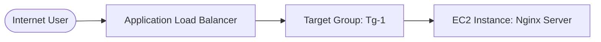

*Source: Internet*

### Step 3: Global Edge Distribution Setup

1. Open the **CloudFront** console and initialize a new edge distribution.
2. Assign the **Origin Domain** field directly to the internal DNS of the Application Load Balancer.
3. *Architectural Standard:* Never map a public CDN directly to isolated compute instances; always leverage a fronting load balancer layer to mask source nodes.
4. Enable the option to **Include Security Protections** to provision a baseline Web ACL during the instantiation phase.

### Step 4: Web Application Firewall (WAF) Integration & Custom Rules

1. Open the **WAF & Shield** environment. The telemetry dashboard handles granular rule sorting across metrics like total entries, blocks, allowed requests, and CAPTCHA interventions.
2. **Configuring Custom IP Sets:**
* Under **IP Sets**, build an entry set named `MyIpset`.
* **Crucial Constraint:** The execution scope must explicitly match **CloudFront (Global)**. Regional designations will hide your IP definitions from the global edge distribution profile.
* Populate your block scope utilizing proper CIDR formatting (e.g., matching local simulation parameters like `183.82.125.5/32`).


3. **Building Custom Rule Frameworks:**
* Create a Web ACL rule structure (`dev-rule-group`).
* Inject an explicit **IP-based match rule**. Map this check to reference the `MyIpset` dictionary.
* Define the terminal execution action as **Block**.


4. **Enabling Bot Protection and Rate Limits:**
* Activate the fully managed **AWS Bot Control Managed Rule Group** to baseline structural threats, block scrappers, and detect credential stuffing vectors.
* Incorporate a **Rate-Based Limit Rule**. Track matching source blocks over a sliding 5-minute matrix. If anomalous automation peaks occur, the source is blocklisted until traffic levels drop.


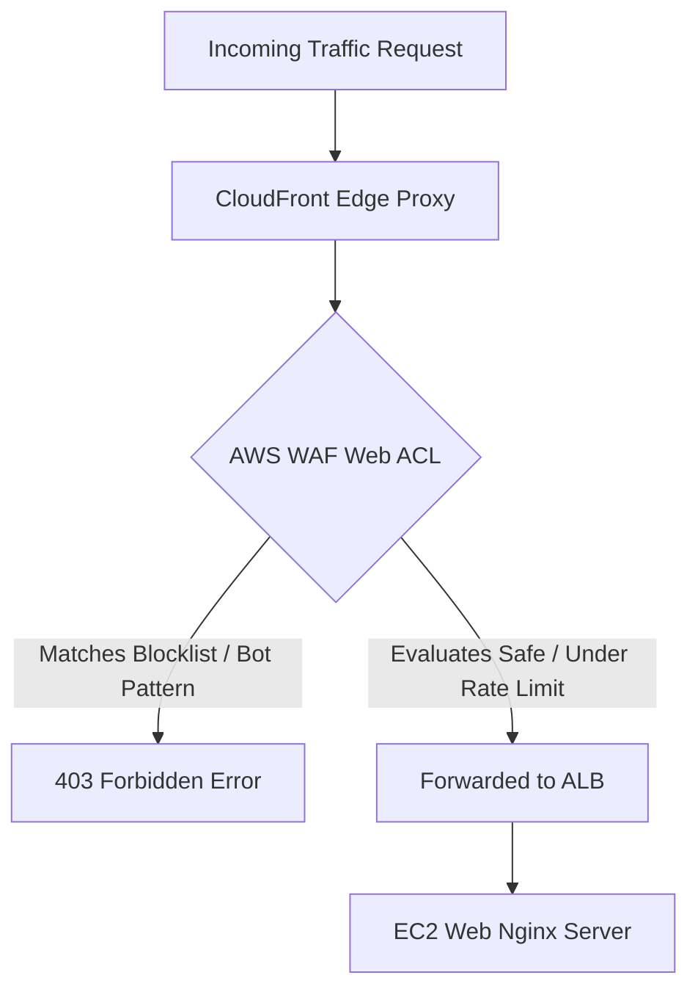

*Source: Internet*

### Step 5: Live Traffic Testing and Cache Eviction

1. When running automated attack simulations (such as a local script sending high-volume curls), the WAF telemetry records a rapid increase in traffic counts.
2. WAF identifies the abnormality, matches the signature/rate profile, and updates the local action state to **Block**, dropping requests with an explicit **403 Forbidden** error response.
3. *Telemetry Validation:* Testing reveals that edge proxies can still return cached files to blocked addresses if the asset lifecycle has not reached its time-to-live threshold.
4. *Remediation Process:* Navigate to your active CloudFront Distribution $\rightarrow$ **Invalidations** $\rightarrow$ Create an invalidation tracking standard root constraints (`/*`). This clear instruction purges the proxy nodes, forcing immediate evaluate-at-edge behavior for subsequent calls.

### Step 6: Continuous Compliance Auditing via AWS Config

1. Navigate to the **AWS Config** service panel to initialize automated system architecture rules.
2. AWS Config acts as an isolated state recorder, keeping historical logs of change paths across tracked network adapters, configurations, and IAM rules.
3. **Deploying AWS Managed Rules:**
* Add a rule utilizing the configuration pattern matching `security-group-closed`.
* This tracking logic continuously evaluates firewall properties across active deployments.


4. **Detecting Compliance Faults:**
* If a developer alters a local firewall policy to expose port 22 globally (`0.0.0.0/0`), AWS Config immediately marks the asset state as **Non-Compliant**.
* This evaluation flow can be linked directly to Amazon SNS to dispatch urgent remediation alerts or clear self-healing workflows automatically.


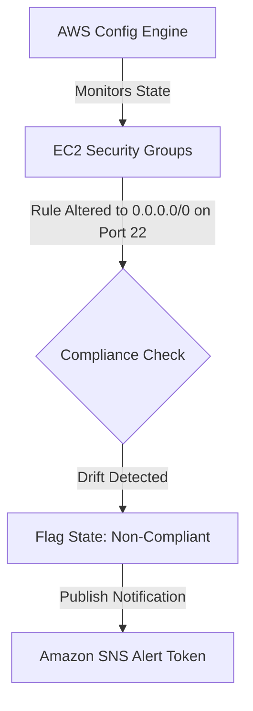

*Source: Internet*

---

## Training Session Interview Questions

1. **Why did the trainer emphasize scope selection when building IP Sets for a CDN firewall?**
*Answer:* AWS WAF divides resource allocations into distinct visibility pools. When protecting global endpoints like CloudFront, you must specify the Global (CloudFront) scope. Selecting a regional scope restricts visibility to your load balancers or API Gateways within that single AWS region.
2. **What sequence of events prevents a newly updated WAF block from taking immediate effect, and how do you resolve it?**
*Answer:* This behavior occurs due to edge object caching. If CloudFront has a valid, unexpired copy of an asset cached at an edge location, it may serve that file without verifying the request against your updated WAF Web ACL. Initiating a **Cache Invalidation** (`/*`) clears these files and forces immediate validation at the edge.
3. **How do AWS Config and CloudTrail differ when auditing unauthorized infrastructure changes?**
*Answer:* CloudTrail acts as an event logger, tracking *who* initiated an API call and *when* it occurred. AWS Config records *what* structural state changed, maintains configuration histories, and evaluates compliance states against a baseline of target parameters.
4. **Why should administrative entry ports like SSH (22) and RDP (3389) never be left open to `0.0.0.0/0`?**
*Answer:* Exposing management ports globally invites constant brute-force scanning and automated attacks. AWS Config rules flag these wide-open scopes as non-compliant to protect production systems from exploitation.

---

## 10 Core L2/L3 Interview Questions & Answers

### Q1. How do you mitigate "Cache Stampede" issues when running a global CloudFront distribution backed by a high-traffic ALB?

**Company Asked:** Amazon
**Answer:** A cache stampede occurs when cached content expires simultaneously under high traffic, causing a massive wave of concurrent requests to hit the origin ALB. To prevent this, you can configure **Origin Shield** as an intermediate caching tier, optimize your cache lifetimes (Cache-Control headers with `stale-while-revalidate`), and use conditional origin requests.

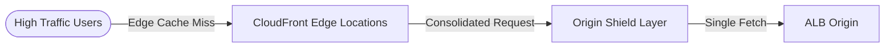

*Source: Internet*

### Q2. How can you securely pass the client's true public IP through CloudFront and an ALB to backend web applications?

**Company Asked:** TCS
**Answer:** CloudFront automatically appends the client's true public IP to the `X-Forwarded-For` HTTP header before proxying requests to your origin ALB. Your backend applications must be configured to parse this header instead of using the packet source IP, which will always show up as the load balancer's internal IP.

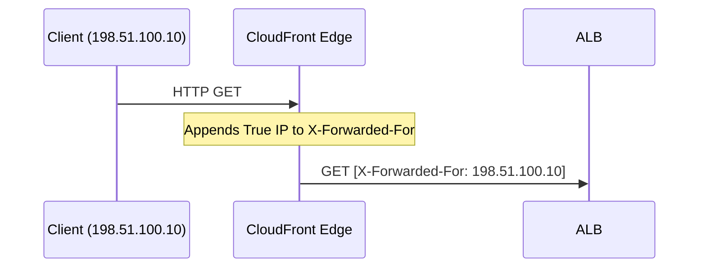

*Source: Internet*

### Q3. Explain the processing difference between a WAF 'Block' action and a 'Challenge' (CAPTCHA) action.

**Company Asked:** Infosys
**Answer:** A **Block** action immediately terminates the request at the edge and returns a customizable HTTP 403 Forbidden status code. A **Challenge** action responds with an interstitial webpage that requires the user to solve a CAPTCHA puzzle within a defined timeframe. If solved successfully, a temporary token cookie is issued, allowing subsequent requests to proceed directly to the origin.

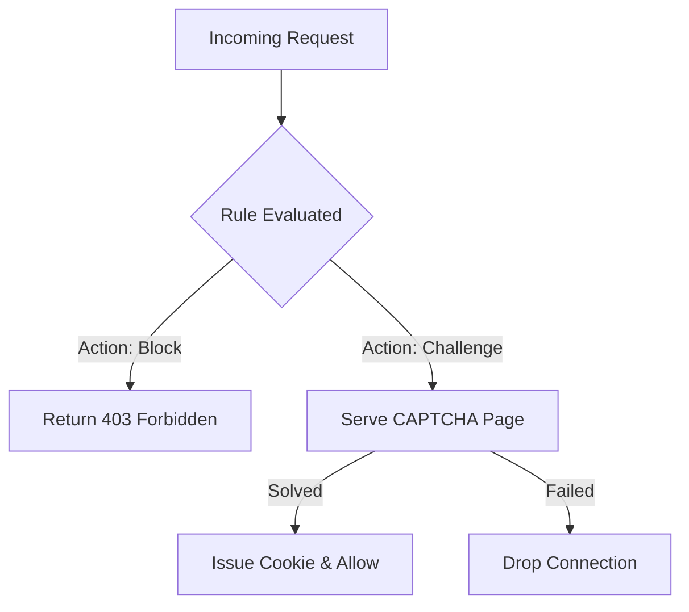

*Source: Internet*

### Q4. How do you design a secure, zero-trust architecture for an application where users must access resources exclusively through CloudFront?

**Company Asked:** Cognizant
**Answer:** You configure CloudFront to use **Origin Access Control (OAC)** for static backends like S3. For dynamic compute backends fronted by an ALB, you can inject a secret custom HTTP header at the CloudFront origin layer and configure the ALB's listener rules to drop any inbound traffic that does not contain that specific header value.

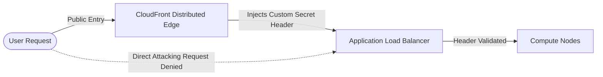

*Source: Internet*

### Q5. What is an AWS WAF Web ACL Token Domain, and how does it prevent cross-site request forgery or replay style mutations?

**Company Asked:** Accenture
**Answer:** When advanced token protections or CAPTCHA sessions are verified by WAF, an encrypted cryptographic token cookie (`aws-waf-token`) is placed on the user's browser. This token is bound to a specific root domain profile. When mutations occur, WAF decrypts and validates the token at the edge to confirm it belongs to an authorized, active session before routing the request down to origin layers.

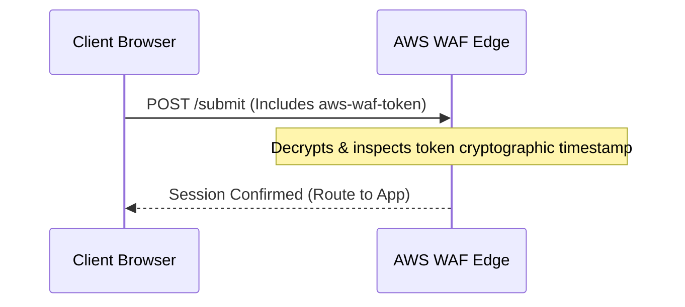

*Source: Internet*

### Q6. How do you automate remediation for an AWS Config rule that flags an exposed database endpoint or an open security group?

**Company Asked:** Amazon
**Answer:** You can use **AWS Systems Manager (SSM) Automation** documents to handle non-compliant resources flagged by AWS Config automatically. When an automated rule flags a security group as non-compliant, it triggers an Amazon EventBridge rule. This rule invokes an SSM Automation workbook that alters the security group parameters to strip away unauthorized public entries (`0.0.0.0/0`), restoring a secure baseline.

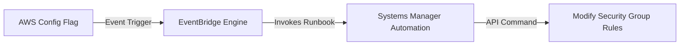

*Source: Internet*

### Q7. How can you implement custom URI path-based protection rules using AWS WAF?

**Company Asked:** TCS
**Answer:** You can create custom rules within a Web ACL using standard string match conditions on the **URI path** field. For instance, to safeguard an administrative route like `/admin`, you create a rule that evaluates if the URI starts with string path `/admin`. You can then chain this with an IP match rule to ensure access is restricted to corporate network segments only.

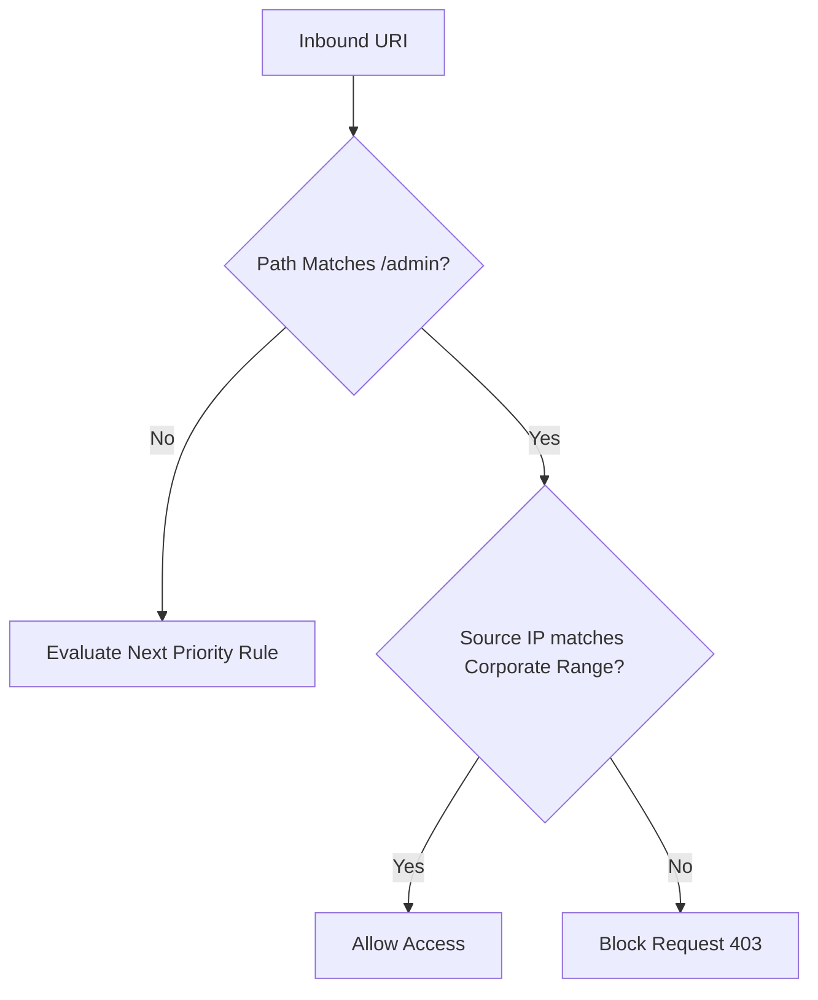

*Source: Internet*

### Q8. What happens to active WebSocket connections through CloudFront if an AWS WAF Web ACL rule update occurs?

**Company Asked:** Infosys
**Answer:** AWS WAF evaluates WebSocket connections exclusively during the initial HTTP handshake upgrade phase. Once the connection is upgraded and established, WAF rules are not evaluated on the persistent frame stream data. Consequently, updating a Web ACL configuration will not close active WebSocket sessions; the rules will only apply to new connection handshakes.

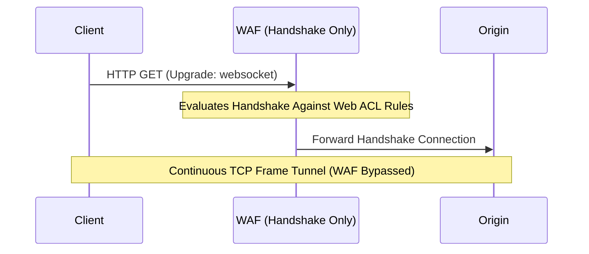

*Source: Internet*

### Q9. How do you structure a Web ACL to mitigate Layer 7 application attacks while minimizing processing costs?

**Company Asked:** Cognizant
**Answer:** AWS WAF charges are based on the number of rules evaluated and the Web ACL capacity units (WCU) used. To control costs, place high-volume, low-processing rules (such as IP blocklists and Geo-restrictions) at the highest priority (lowest numbers). Complex deep-packet inspection rules (such as regex pattern groups and managed SQLi rule sets) should be processed lower down the chain, filtering out malicious traffic before it reaches resource-heavy checks.

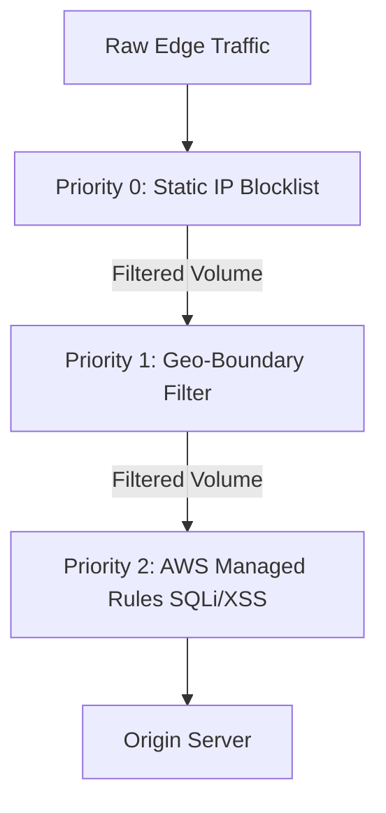

*Source: Internet*

### Q10. How do you use AWS Config Aggregators to audit multi-region, multi-account security compliance from a central security hub?

**Company Asked:** Accenture
**Answer:** An AWS Config Aggregator consolidates configuration data and compliance states from multiple AWS accounts and regions into a single control tower view. By setting up an enterprise aggregator within an AWS Organizations management account, security teams can detect compliance drifts anywhere in the organization instantly, without logging into individual regional dashboards.

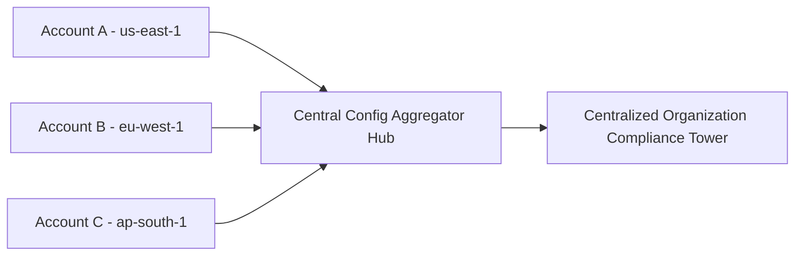

*Source: Internet*

---

## Architectural Insights & System Strategies

1. **Enforce Origin Isolation with Infrastructure-as-Code:**
Avoid manual adjustments to your edge and load balancing tiers. Define your security architectures completely using infrastructure code tools like Terraform or AWS CloudFormation. Ensure that internal server networks accept connections strictly from the Application Load Balancer using managed prefix pools, preventing attackers from identifying and targeting origin servers directly.
2. **Mitigate False Positives with Log Auditing:**
Before setting complex security rules (such as SQL injection or cross-site scripting filters) to "Block", deploy them in "Count" mode first. Route your system metrics to an Amazon S3 log repository and use analytics tools like Amazon Athena to confirm the rules don't intercept legitimate client traffic.
3. **Implement Continuous Drift Remediation:**
Do not rely on point-in-time infrastructure scans. Combine state management tracking services like AWS Config with event routers like Amazon EventBridge. When a compliance change occurs (such as accidentally opening database management systems or leaving ports open to the public), trigger automated scripts to remove the open access paths instantly, before vulnerabilities can be exploited.
