# DevOps Training Notes: GitHub Actions, Azure OIDC, and Terraform

## 1. To-the-Point Summary

This session focuses on configuring a secure, passwordless CI/CD pipeline using GitHub Actions to deploy infrastructure on Microsoft Azure via Terraform. The core transition discussed is moving away from legacy, expiring Secret-based authentication toward OpenID Connect (OIDC) using Federated Credentials within Azure App Registrations. The trainer provides a step-by-step walkthrough of establishing a trust relationship between a GitHub repository and Azure, configuring repository secrets in GitHub, and authoring a foundational Terraform workflow YAML file using standard GitHub actions (`actions/checkout` and `hashicorp/setup-terraform`).

---

## 2. Detailed Training Notes

### 2.1. Runners Recap

The session began with a brief recap of pipeline runners:

* **Self-Hosted Runners:** Compared to "your own car." They are dedicated to you, always standing by, and allow you to deploy workflows to any destination.
* **GitHub-Hosted Runners:** Compared to a "rented car." They spin up to do the job, drop you at your destination, and then terminate.

### 2.2. Microsoft Entra ID and App Registrations

To deploy resources to Azure, authentication must be established.

* Navigate to **Microsoft Entra ID** (formerly Azure Active Directory) in the Azure Portal.
* Go to **App Registrations**.
* When creating or viewing an App Registration, you are provided with a **Client ID**, **Tenant ID**, and an **Object ID**.
* **Object ID:** This is the specific ID used when assigning permissions (Role-Based Access Control) to the application. For example, if you want to grant the App Registration "Contributor" access to a subscription or permission to access a Key Vault, you use the Object ID.

### 2.3. Secrets vs. Federated Credentials (OIDC)

The trainer highlighted a shift in industry best practices regarding authentication.

* **Client Secrets (Deprecated approach):**
* Historically, pipelines authenticated using a Client Secret (a password).
* This method is becoming deprecated because secrets expire, require manual renewal, and pose security risks if leaked.


* **Federated Credentials (OIDC - Recommended approach):**
* OIDC stands for **OpenID Connect**.
* It operates on a **Trust Basis** between an external identity provider (GitHub) and Azure.
* Instead of a permanent password, OIDC generates a **temporary identity token** (a short-lived password) for the pipeline to enter Azure.
* This eliminates the need to manage, store, or rotate secrets.


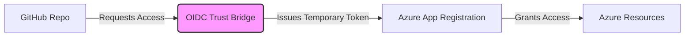

*Diagram 1: OIDC Trust Flow explained by the trainer.*

### 2.4. Step-by-Step: Setting up Federated Credentials in Azure

The trainer demonstrated the exact steps to establish this trust:

1. In your Azure App Registration, click on **Certificates & secrets**.
2. Navigate to the **Federated credentials** tab.
3. Click **+ Add credential**.
4. From the dropdown, select the scenario: **GitHub Actions deploying Azure resources**.
5. Fill in the exact GitHub details to establish the trust bridge:
* **Organization:** The GitHub username or Organization name (e.g., `ashishkashyap`).
* **Repository:** The specific repository name (e.g., `GitHubActions_Learning`).
* **Entity Type:** Select the trigger type. Options include Environment, Branch, Pull Request, or Tag. The trainer selected **Branch**.
* **GitHub branch name:** Enter the branch name (e.g., `main`).


6. **Subject Identifier:** Azure automatically generates this string (e.g., `repo:ashishkashyap/GitHubActions_Learning:ref:refs/heads/main`). This is the exact string Azure will look for when GitHub requests access.
7. **Name:** Give the credential a name (e.g., `Terraform_OIDC`).
8. Click **Add**.

### 2.5. Step-by-Step: Setting up GitHub Repository Secrets

Once Azure trusts GitHub, GitHub needs to know *where* to go in Azure.

1. Go to your GitHub Repository -> **Settings** -> **Secrets and variables** -> **Actions**.
2. Click **New repository secret**.
3. You must add the following secrets, copying the values from your Azure App Registration Overview page:
* `AZURE_CLIENT_ID`
* `AZURE_TENANT_ID`
* `AZURE_SUBSCRIPTION_ID`


### 2.6. Step-by-Step: Writing the GitHub Actions Workflow

The trainer started authoring the `terraform.yml` file inside the `.github/workflows/` directory.

1. **Trigger (`on`):**
```yaml
name: "Terraform Azure Deploy"
on:
  push:
    branches:
      - "main"

```


```
    *This ensures the pipeline only runs when code is pushed to the main branch.*

2.  **Jobs and Runner:**
    ```yaml
jobs:
  terraform:
    runs-on: ubuntu-latest

```

```
*The trainer selected `ubuntu-latest` as a GitHub-hosted runner for this job.*

```

3. **Steps (Using Actions from the Marketplace):**
* **Checkout Code:** To get the code from the repo onto the runner, use the `actions/checkout` action.
* **Setup Terraform:** To install Terraform on the runner, use `hashicorp/setup-terraform`.
* *Trainer Note:* The version tag on the action (e.g., `@v7.0.0`) refers to the version of the *GitHub Action*, not the version of Terraform itself. To specify the Terraform version, use the `with: terraform_version:` parameter.


```yaml
    steps:
      - name: Checkout
        uses: actions/checkout@v7.0.0

      - name: HashiCorp - Setup Terraform
        uses: hashicorp/setup-terraform@v2.0.3
        # with: 
        #   terraform_version: "1.9.0"  (Optional)

```


```

---

## 3. Interview Questions Discussed by Trainer

**Q1. What is the difference between a Client ID and an Object ID in Azure App Registrations?**
*Answer:* The Client ID is the unique identifier for the application itself, used during authentication. The Object ID is the unique identifier for the application's service principal within the specific Microsoft Entra tenant, and it is the ID used when assigning Role-Based Access Control (RBAC) permissions (like Contributor access or Key Vault access) to the application.

**Q2. Why is the industry moving away from Client Secrets in CI/CD pipelines?**
*Answer:* Client Secrets act like permanent passwords. They have an expiration date, requiring manual intervention to renew them, and if they are exposed or hardcoded, they pose a massive security risk. OIDC (Federated Credentials) replaces this by using a trust relationship that generates temporary, short-lived tokens, eliminating the need to store passwords.

**Q3. When setting up a Federated Credential in Azure for GitHub Actions, what "Entity Types" can you establish trust for?**
*Answer:* You can establish trust based on specific GitHub entities: an Environment, a specific Branch (like `main`), a Pull Request, or a specific Tag (like a release version `v7.0.0`). This ensures that Azure only grants access if the request comes from that exact entity.

---

## 4. Top 10 L2/L3 Interview Questions from the Internet

**[Important] Q1. (Asked at Microsoft) Explain the architectural difference between using an Azure Service Principal with a Secret versus using OpenID Connect (OIDC) in GitHub Actions.**
*Answer:* A Service Principal with a secret relies on symmetric authentication; GitHub stores a static string (the secret) and presents it to Azure. If the secret is compromised, the environment is breached. OIDC uses asymmetric, federated trust. GitHub is the Identity Provider (IdP). When a workflow runs, GitHub generates a JSON Web Token (JWT). Azure validates this JWT against GitHub's OIDC endpoint using public keys. If valid, Azure issues a temporary, scoped access token. No static secrets are stored in GitHub.
*(Source: Internet)*
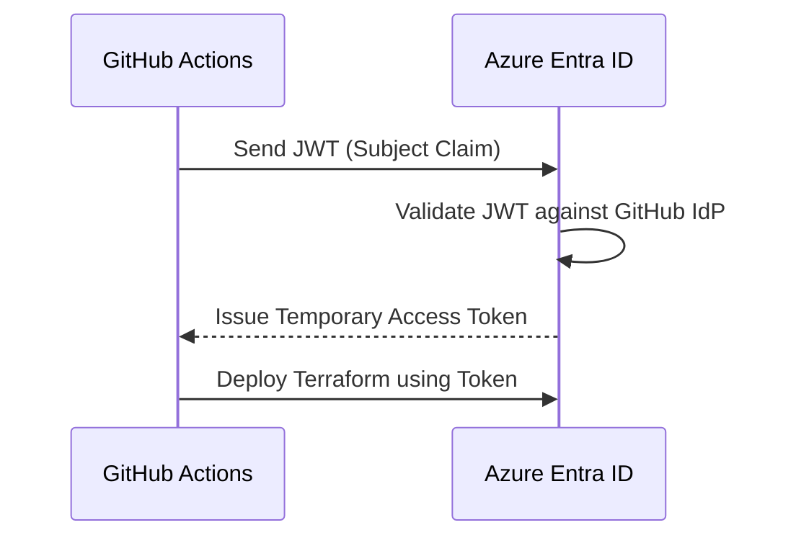

*Diagram 2: OIDC Token Exchange.*

**[Important] Q2. (Asked at Amazon) How do you handle Terraform state file locking and concurrency when running deployments via GitHub Actions?**
*Answer:* When running Terraform in automation, state locking is critical to prevent state corruption from concurrent pipeline runs. In Azure, this is handled by storing the `terraform.tfstate` file in an Azure Blob Storage container. We configure the `backend "azurerm"` block in Terraform. Azure Blob Storage automatically provides state locking via blob leases. If Pipeline A is running `terraform apply`, it holds a lease. If Pipeline B triggers simultaneously, it will fail to acquire the lease and queue or fail, preventing corruption.
*(Source: Internet)*

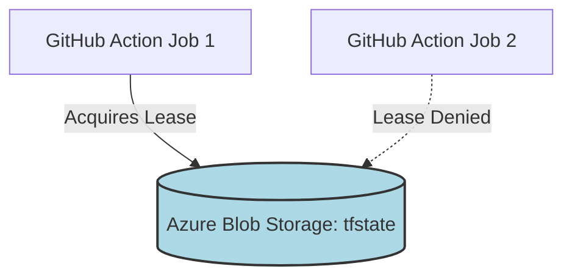

*Diagram 3: Terraform State Locking.*

**Q3. (Asked at Netflix) In a GitHub Actions workflow, how do you prevent sensitive outputs from Terraform (like database connection strings) from leaking into the GitHub logs?**
*Answer:* First, in Terraform, mark sensitive variables and outputs with `sensitive = true`. This prevents Terraform from printing them to the CLI. Second, in GitHub Actions, use the `::add-mask::` workflow command or rely on GitHub's native secret masking, which automatically scrubs known repository secrets from logs. Finally, ensure that the `hashicorp/setup-terraform` action is configured correctly, as its wrapper inherently masks outputs marked as sensitive in Terraform 0.14+.
*(Source: Internet)*

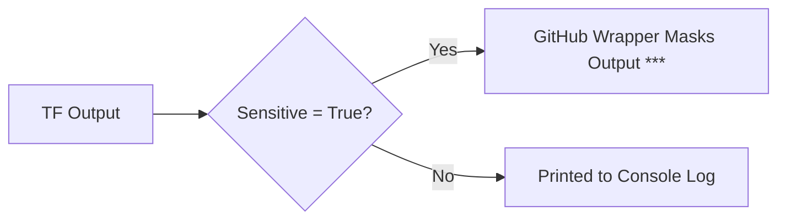

*Diagram 4: Log Masking Workflow.*

**[Important] Q4. (Asked at Target) How do you design a GitHub Actions pipeline to deploy to multiple environments (Dev, QA, Prod) using the same workflow file?**
*Answer:* I use GitHub Actions `environments` and reusable workflows. The workflow is triggered and utilizes a `matrix` strategy or sequential `jobs` mapped to GitHub Environments (e.g., `environment: prod`). Each GitHub Environment holds its own scoped variables and secrets (like different `AZURE_CLIENT_ID`s for different subscriptions). Furthermore, I configure environment protection rules in GitHub (like manual approval gates) before the `Prod` job can execute.
*(Source: Internet)*

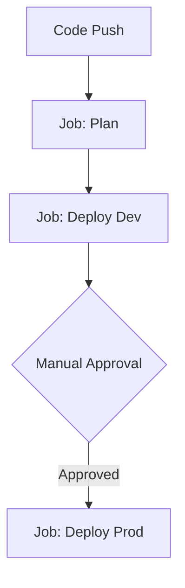

*Diagram 5: Multi-Environment Promotion.*

**Q5. (Asked at Uber) If your OIDC connection fails with a "Subject identifier mismatch" error, how do you troubleshoot and fix it?**
*Answer:* This error occurs because the Subject Claim (`sub`) generated by the GitHub workflow does not exactly match the Subject Identifier configured in the Azure Federated Credential. I would check the Azure App Registration -> Federated Credentials. If it is set to Entity Type "Branch" and Branch Name "main", the expected subject is `repo:org/repo:ref:refs/heads/main`. If the workflow is actually running on a branch named `feature/update`, the JWT will contain `refs/heads/feature/update`, causing a mismatch. I would align the Azure configuration with the GitHub trigger, or use wildcard subject claims if using custom deployment branches.
*(Source: Internet)*

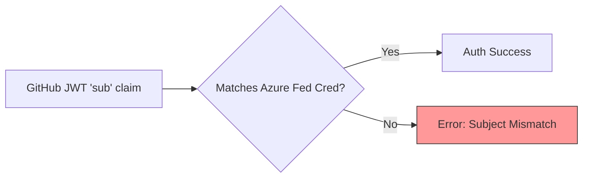

*Diagram 6: Subject Claim Validation.*

**Q6. (Asked at Meta) How do you implement Terraform Drift Detection using GitHub Actions?**
*Answer:* Drift detection ensures the actual cloud infrastructure matches the Terraform state. I create a scheduled GitHub Action workflow using `on: schedule: - cron: '0 0 * * *'` (e.g., running nightly). The job executes `terraform plan -detailed-exitcode`. If drift exists, Terraform returns an exit code of 2. I configure the workflow to catch this exit code and trigger an alert, such as sending a notification to a Slack/Teams webhook or creating a GitHub Issue using `actions/github-script`.
*(Source: Internet)*

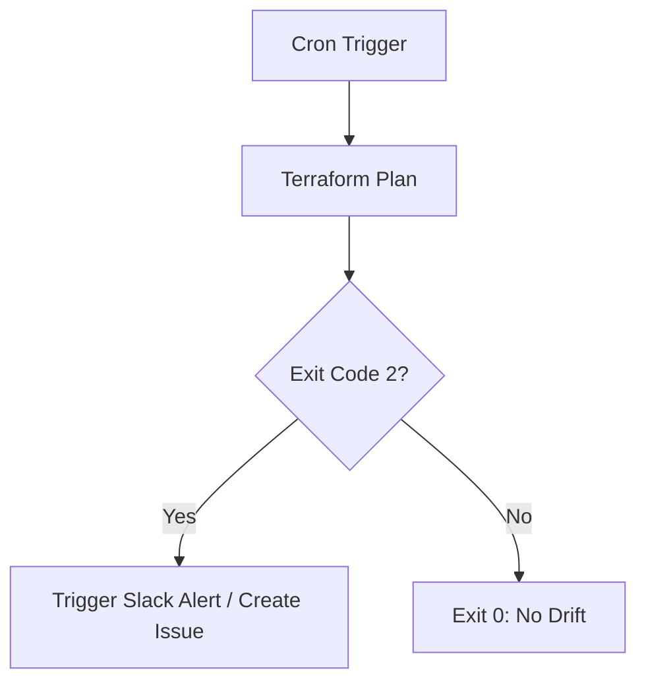

*Diagram 7: Drift Detection Architecture.*

**Q7. (Asked at Google) Explain the purpose of `id-token: write` in a GitHub Actions workflow that uses OIDC.**
*Answer:* The `permissions` block in a workflow limits what the `GITHUB_TOKEN` can do. By default, the token cannot generate OIDC JWTs for security reasons. Setting `id-token: write` explicitly grants the workflow permission to fetch an OIDC token from GitHub's OIDC provider. Without this permission, the `azure/login` or Terraform Azure provider steps will fail with a `403 Forbidden` error when attempting to authenticate with Azure.
*(Source: Internet)*

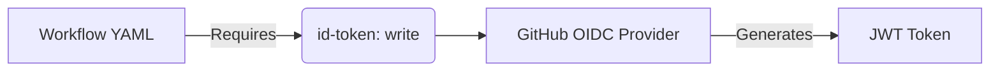

*Diagram 8: ID-Token Permission Flow.*

**Q8. (Asked at LinkedIn) How do you pass variables between jobs in a GitHub Actions workflow? (e.g., passing a Terraform plan ID to an apply job).**
*Answer:* To pass data between jobs, which run on entirely different runner instances, I use GitHub Actions `outputs` and `artifacts`. For simple strings (like a resource ID), I set a job-level output using `$GITHUB_OUTPUT` and reference it in the next job using `needs.job_name.outputs.var_name`. For files, like a compiled `terraform.tfplan` binary, I use the `actions/upload-artifact` in the Plan job, and `actions/download-artifact` in the Apply job.
*(Source: Internet)*

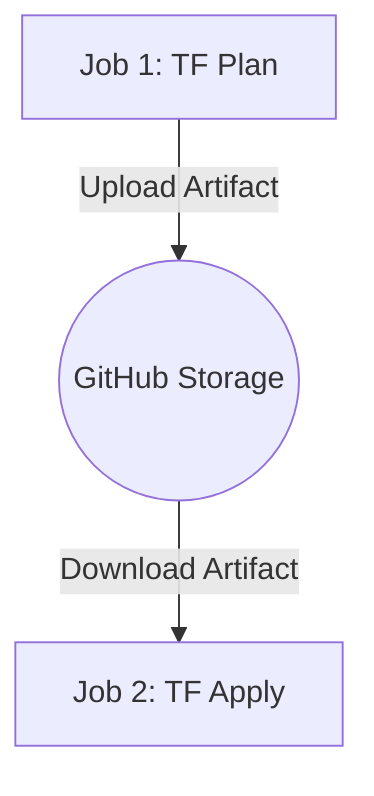

*Diagram 9: Artifact Sharing between Jobs.*

**Q9. (Asked at Stripe) What is the `hashicorp/setup-terraform` action actually doing under the hood? Why not just use `apt-get install terraform`?**
*Answer:* While you could use `apt-get`, `setup-terraform` is vastly superior. It downloads a specific, cached version of the Terraform binary, making the pipeline faster. It configures a CLI configuration file (`.terraformrc`) automatically. Most importantly, it creates a wrapper script around the Terraform binary that intercepts standard output and standard error. This wrapper exposes Terraform outputs as GitHub workflow outputs and automatically masks sensitive data in the GitHub UI logs.
*(Source: Internet)*

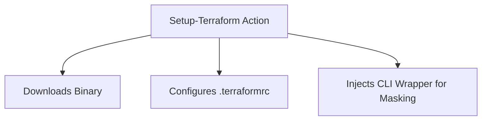

*Diagram 10: Setup-Terraform capabilities.*

**[Important] Q10. (Asked at Walmart) If you have a Monorepo with multiple microservices and separate Terraform directories, how do you ensure GitHub Actions only runs Terraform for the directory that was modified?**
*Answer:* I use path filtering in the workflow trigger. In the `on: push:` block, I define `paths: ['infrastructure/service-a/']`. This ensures the workflow only triggers if files inside that specific directory change. Inside the job, I set the `working-directory` parameter for all run steps to point to that specific subfolder, ensuring Terraform commands execute in the correct context.
*(Source: Internet)*

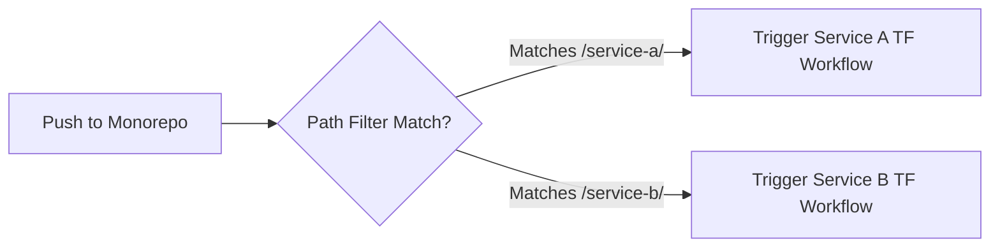

*Diagram 11: Monorepo Path Filtering.*

---

## 5. Tips from a DevOps Architect (20+ Years Experience)

1. **Always Decouple Plan and Apply:** Never run `terraform plan` and `terraform apply -auto-approve` in the same uncontrolled, automated step for Production environments. Use separate jobs in GitHub actions. Upload the `.tfplan` file as an artifact in the Plan job, implement a manual approval gate using GitHub Environments, and download that exact `.tfplan` artifact in the Apply job. This guarantees that what you approved is mathematically exactly what gets deployed.
2. **Strict Least Privilege for App Registrations:** When creating your Azure App Registration for OIDC, avoid the temptation to just assign "Contributor" to the entire Subscription. Scope the RBAC role at the Resource Group level where possible, and use custom roles if Terraform only needs to manage specific resource types (e.g., only Networking and VMs).
3. **Implement Security Scanning in the CI Phase:** Before the `terraform plan` even runs, inject a security scanning job using a tool like `tfsec` or `checkov`. If a developer attempts to commit Terraform code that opens an AWS S3 bucket to the public or exposes an Azure port 3389, the pipeline should fail the PR instantly before it reaches the planning or deployment phase.
