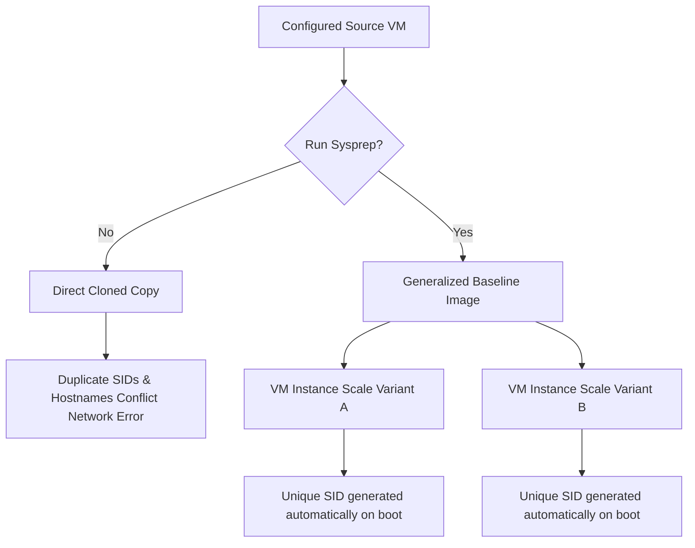
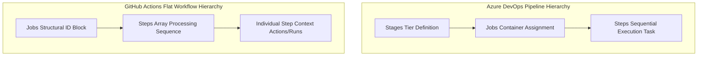
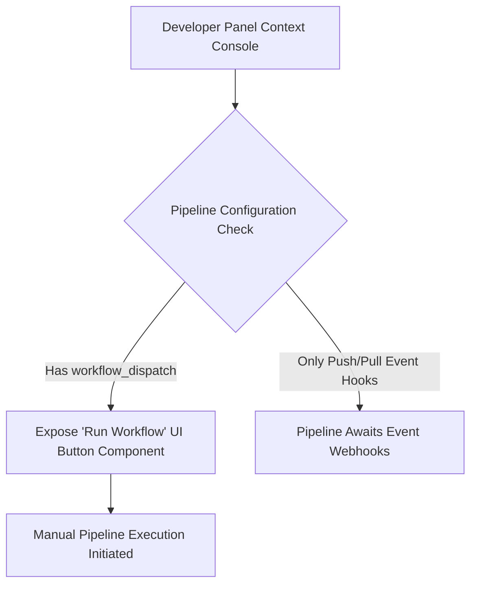
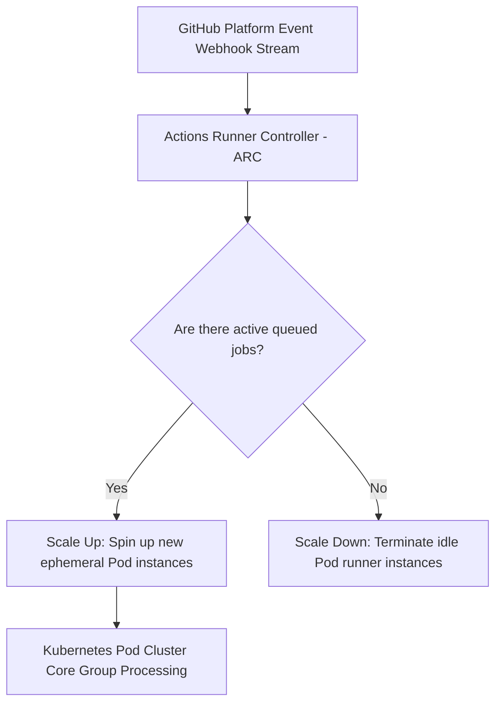
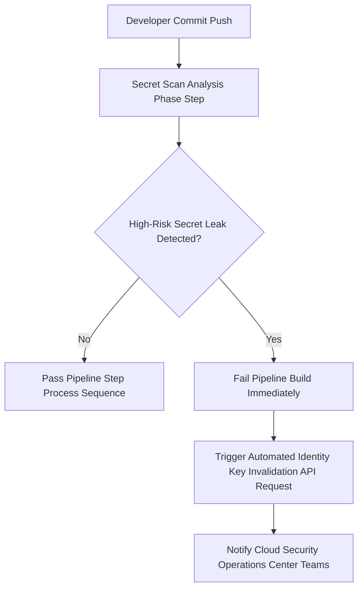
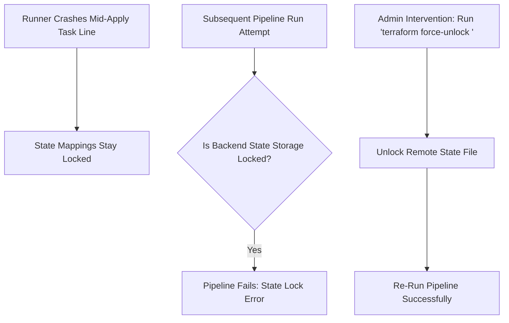
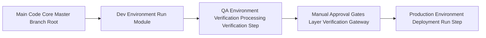
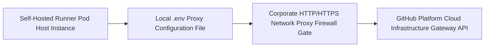

# DevOps Engineering Notes: GitHub Actions vs. Azure DevOps (ADO) & Self-Hosted Runner Configurations

---

## ## To-the-Point Summary

This session provides a comprehensive architectural and practical comparison between **Azure DevOps (ADO)** and **GitHub Actions (GHA)** for driving Infrastructure as Code (IaC) via Terraform. The core focus highlights transitioning concepts from ADO to GitHub Actions, configuring infrastructure dependencies, setting up **Self-Hosted Runners**, establishing secure cloud authentication using **Azure Service Principals (SP)**, and breaking down YAML workflow syntax. It also addresses standard operational hurdles such as generalized system imaging (`sysprep`), environment drift management, and syntax validation utilizing tools like ChatGPT and YAML Lint.

---

## ## Detailed Class Notes & Step-by-Step Guide

### ### 1. Pre-Session Discussion: Image Generalization & Drift Management

Before diving into the core pipeline execution, a critical infrastructure discussion occurred regarding managing multiple Virtual Machines ($VMs$) within an enterprise cluster:

* **The Problem:** When creating copies of a configured virtual machine ($VM\_A$ to $VM\_B$), a direct disk snapshot retains unique identification factors such as the **Hostname** and **Security Identifier (SID)**. This creates conflicts on the network.
* **The Solution (Sysprep):** Operating System ($OS$) teams utilize the **Sysprep** command line utility in Windows to generalize the machine image. This strips out unique SIDs and computer hostnames, enabling clean scaling across an environment.
* **Configuration Drift:** Performing manual modifications inside cloud portals creates architecture drift against the declarative definitions written in Terraform code. Automated CI/CD execution ensures Git acts as the single source of truth.

### ### 2. Architectural Concepts Mapping: ADO vs. GitHub Actions

The trainer mapping demonstrated that despite varying nomenclature, the fundamental operational blocks of both platforms map directly onto one another:

| Functional Layer | Azure DevOps (ADO) Platform Component | GitHub Actions (GHA) Platform Component |
| --- | --- | --- |
| **Pipeline Workflow** | Yaml Pipeline | GitHub Action / Workflow File |
| **Code Repository** | Azure Repos / GitHub Repo | GitHub Repository Only |
| **Compute Execution Unit** | Agent (Microsoft-Hosted or Self-Hosted) | Runner (GitHub-Hosted or Self-Hosted) |
| **Cloud Authentication Gateway** | Service Connection (Service Principal) | Service Principal / OIDC Credentials |

---

### ### 3. Step-by-Step Setup: Configuring a GitHub Self-Hosted Runner

To execute custom or sensitive workflow jobs securely behind internal corporate firewalls, a self-hosted runner must be linked to the repository:

* **Step 1:** Navigate to your enterprise GitHub Repository.
* **Step 2:** Select the top navbar option **Settings** $\rightarrow$ expand the **Actions** dropdown menu on the left pane $\rightarrow$ click on **Runners**.
* **Step 3:** Click the green button labelled **New self-hosted runner**.
* **Step 4:** Select your target operating platform (**Windows**, **Linux**, or **macOS**).

```
[ GitHub Repo ] ➔ [ Settings ] ➔ [ Actions ] ➔ [ Runners ] ➔ [ New Self-Hosted Runner ]

```

#### #### Windows Runner Command Implementation Sequence:

Open a PowerShell terminal context inside your target host machine and implement the following execution chain directed by the GitHub UI console:

```powershell
# 1. Create a dedicated project orchestration directory
mkdir actions-runner; cd actions-runner

# 2. Download the designated platform runner binaries zipped package 
Invoke-WebRequest -Uri "https://github.com/actions/runner/releases/download/v2.311.0/actions-runner-win-x64-2.311.0.zip" -OutFile "actions-runner-win-x64-2.311.0.zip"

# 3. Perform cryptographic hash verification to ensure package integrity
if ((Get-FileHash -Path "actions-runner-win-x64-2.311.0.zip" -Algorithm SHA256).Hash -ne "cryptographic_hash_provided_by_github") { Write-Error "Checksum validation failed!" }

# 4. Extract package installation architecture
Add-Type -AssemblyName System.IO.Compression.FileSystem
[System.IO.Compression.ZipFile]::ExtractToDirectory("$PWD\actions-runner-win-x64-2.311.0.zip", "$PWD")

# 5. Configure the local agent registry mapping utilizing unique repository PAT token
.\config.cmd --url https://github.com/SPSNGH3011/github-action-crash-course --token <ENTER_YOUR_DYNAMIC_RUNNER_TOKEN_HERE>

# 6. Kickstart execution loop monitoring parameters
.\run.cmd

```

> **Important:** Once `.\run.cmd` is executed, the console output will switch status updates to `Listening for Jobs`. In the GitHub UI panel, the runner state changes from *Offline* to *Idle*, meaning it is ready to handle computational loads.

---

### ### 4. Azure Authentication Protocol via Service Principal

To allow GitHub Actions to build components inside Microsoft Azure, a Service Principal token framework must be configured via App Registrations:

1. Navigate to **Azure Active Directory / Entra ID** $\rightarrow$ **App Registrations** $\rightarrow$ **New Registration**.
2. Assign a definitive scope role (e.g., **Contributor**) to this application framework across your target **Azure Subscription** plane.
3. Securely extract and store the authentication parameters:
* `clientId` (Acts as the unique application Username)
* `clientSecret` (Acts as the application Password)
* `tenantId` (Identifies the cloud structural directory tenant space)


#### #### Verification via CLI:

```bash
az login --service-principal --username <client-id> --password <client-secret> --tenant <tenant-id>

```

---

### ### 5. Analyzing YAML Pipeline Architecture Structures

The execution layout definitions require formatting updates when moving from Azure DevOps templates over to GitHub Actions:

```yaml
# GitHub Action Workflow Syntax Reference Architecture Example
name: terraform-deployment-pipeline # Pipeline structural tracking descriptor

on: 
  workflow_dispatch: # Enables manual triggering from the GitHub Actions console UI

jobs:
  infrastructure-build:
    runs-on: self-hosted # Forces target processing via our configured local runtime runner
    
    steps:
      - name: Code Repository Synchronization Checkout
        uses: actions/checkout@v4 # Clones repository files locally onto the workspace area

      - name: Execute Shell Initialization Script Block
        run: |
          echo "Initiating environment build phases..."
          terraform --version

```

> **Important:** Unlike Azure DevOps, which uses the block structure labels `stages`, `jobs`, `steps`, `task`, **GitHub Actions drops the `stages` categorization tier completely**. It structures task sequences through a direct **`jobs` $\rightarrow$ `steps` $\rightarrow$ `run`/`uses**` schema hierarchy.

---

## ## Interview Questions Sourced from Session

The following questions reflect the core topics and architectural principles reviewed during the session:

1. **What is the operational purpose of running the `sysprep` utility command line tool on virtual instances before template capturing?**
2. **How do the operational components of Azure DevOps map over to GitHub Actions pipelines?**
3. **What changes in structural indentation labels when moving from an ADO pipeline layout to GitHub Actions?**
4. **What exact command structure executes an automated non-interactive terminal authentication login via an Azure Service Principal?**
5. **How do you enable manual pipeline execution runs for a GitHub Actions workflow file?**

---

## ## Sourced L2/L3 Enterprise Interview Questions

* Sourced via Internet Research for Senior DevOps Roles (Sourced: Internet).

### ### Q1. Managing Dynamic Scale States for Self-Hosted Runners (**Marked Part As Important**)

> **Asked at:** *Microsoft, Deloitte*
> **Question:** How do you design and architect secure, auto-scaling self-hosted runner groups in Kubernetes environments for high-throughput enterprise developer spaces?

### ### Q2. Mitigating Secret Exposure Hazards within Public Multi-Tenant Repositories

> **Asked at:** *Capgemini, Accenture*
> **Question:** How do you implement automated controls to prevent structural credential leakages in public workflows, and how do you remediate compromised Active Directory tokens if an exposure event happens?

### ### Q3. Handling Terraform Remote Backend Locks and Race Conditions

> **Asked at:** *TCS, Cognizant*
> **Question:** What structural troubleshooting procedures do you implement if an enterprise runner crashes during a long-running `terraform apply` phase, leaving your State Storage architecture locked inside a remote blob container?

### ### Q4. Structuring Multi-Environment Dependency Promotion Matrix Maps

> **Asked at:** *Amazon, Walmart Global Tech*
> **Question:** How do you structure a singular, reusable GitHub Actions pipeline blueprint layout file that securely manages state tracking transformations across Dev, QA, and Production environments without rewriting duplicate workflow steps?

### ### Q5. Designing Workarounds for Restricted Corporate Network Proxies

> **Asked at:** *Wipro, HCLTech*
> **Question:** How do you configure a newly instantiated enterprise self-hosted runner to communicate back with the GitHub platform if the target host machine sits inside an air-gapped corporate network subnet behind severe HTTP proxy gateways?

### ### Q6. Migrating Complex Legacy Shared Libraries from Jenkins to GitHub Custom Actions

> **Asked at:** *Infosys, Tech Mahindra*
> **Question:** When migrating from Jenkins to GitHub Actions, what structural paradigm transformation process do you use to convert modular Groovy shared library configurations into reusable Composite or JavaScript-based Custom Actions?

### ### Q7. Optimizing Cache and Artifact Management Across Ephemeral Environments

> **Asked at:** *IBM, Cisco*
> **Question:** How do you optimize dependency resolution wait-times for heavy Node.js or Java builds running inside stateless, ephemeral runner containers?

### ### Q8. Enforcing Security Compliance and Principal Least Privilege Matrix Frameworks

> **Asked at:** *Ernst & Young, PwC*
> **Question:** How do you design open authentication connections via GitHub Actions to cloud environments without generating long-lived static Secret keys?

### ### Q9. Resolving YAML Merge Conflict Blocks Across Distributed Teams

> **Asked at:** *Oracle, Salesforce*
> **Question:** How do you isolate, track down, and validate hidden syntax errors and configuration drift anomalies introduced into complex, 1000+ line nested workflow pipelines by global engineering cohorts?

### ### Q10. Orchestrating Multi-Region Failover Plans for Corporate Infrastructure Planes

> **Asked at:** *Google, Cloudflare*
> **Question:** How do you construct an high-availability disaster recovery framework logic maps for internal enterprise self-hosted runner systems if a primary cloud hypervisor data-center zone drops connection entirely?

---

## ## Expert Answers Section (With Architecture Diagrams)

#### #### Answer 1: Core System Generalization Processing (`sysprep`)

The execution of `sysprep` strips system-specific data out from an active instance. Without running this utility, cloned duplicates spin up on the network sharing identical Security Identifiers (SIDs) and hostname properties, breaking host communication mappings across enterprise directory controllers.



---

#### #### Answer 2: ADO to GitHub Actions Structural Concepts Mapping

Transitioning from Azure DevOps over to GitHub Actions requires mapping structural blocks from one execution syntax space to the other. For instance, an ADO Agent maps to a GitHub Runner, while Service Connections are replaced by OIDC-integrated Service Principals.

```mermaid
graph LR
    subgraph Azure DevOps Platform Space
        A[Yaml Pipeline] --> B[Azure Repo Code]
        B --> C[Hosted/Self Agent]
        C --> D[Service Connection Link]
    </subgraph>
    subgraph GitHub Actions Platform Space
        E[Workflow Template] --> F[GitHub Repo Code]
        F --> G[Hosted/Self Runner]
        G --> H[OIDC/Secret Service Principal]
    </subgraph>
    A -.-> E
    B -.-> F
    C -.-> G
    D -.-> H

```

---

#### #### Answer 3: Indentation Schema Transitions for Multi-Tier Structuring

Azure DevOps tracks build blocks under a distinct three-tier pipeline structural hierarchy (`stages` $\rightarrow$ `jobs` $\rightarrow$ `steps`). GitHub Actions flattens this schema layout into a direct **`jobs` $\rightarrow$ `steps**` tree model, using explicit array markers (`-`) to step through individual processing tasks.



---

#### #### Answer 4: Non-Interactive App Identity Verification Logic Mappings

Executing zero-touch non-interactive login processes within automated runners requires passing structural parameters down directly to the Azure CLI. This bypasses interactive web-based browser challenges during automated background processing runs.

```mermaid
sequenceDiagram
    participant GH as GitHub Runner Context Instance
    participant AZ as Azure Active Directory Gateway
    participant RM as Resource Management Plane API
    GH->>AZ: Send az login tokens (Client ID, Secret, Tenant ID)
    Active-Directory Verification Check Processing Loop...
    AZ-->>GH: Return App Authorization Token Block
    GH->>RM: Execute Cloud Infrastructure Builds Mappings
    RM-->>GH: Return Deployment Success Code Summary

```

---

#### #### Answer 5: Manual Processing Configuration Triggers via UI Consoles

To toggle visibility hooks for manual pipeline controls, you must specify the `workflow_dispatch` trigger key within the workflow file's orchestration block (`on:`). This exposes manual execution controls within the GitHub enterprise user panel interface.



---

#### #### Answer 6: Kubernetes Automated Scaling Runner Group Layout Mappings (**Important**)

Implementing automated scaling configurations within Kubernetes groups is handled using the **Actions Runner Controller (ARC)** pattern. ARC monitors GitHub's internal event hooks stream and dynamically scales runner pods up or down to match workload volume.



---

#### #### Answer 7: Secret Detection Scanners and Rotation Logic Cascades

Enterprise pipelines run continuous scanning layers using integrated security hook steps (such as GitGuardian or GitHub Advanced Security Secret Scanning). If a secret is exposed, the step fails the build immediately and kicks off an automated API call to rotate the compromised cloud key.



---

#### #### Answer 8: Overcoming Remote Backend Lock Blocks and Outage States

If a runner loses connection mid-execution, the remote backend lock file remains active in storage, causing subsequent runs to fail. Resolving this state block requires looking up the associated unique ID and executing a targeted unlock command to free up the state track file.



---

#### #### Answer 9: Multi-Environment Promotion Design Framework Configurations

Promoting changes across code bases uses clean structural separation methods. Environmental state paths are isolated inside separate directories or parameter files, preventing configuration overlaps as changes advance through Dev, QA, and Production target zones.



---

#### #### Answer 10: Enterprise Proxy Traversal Connectivity Routing Maps

To route traffic out from highly secure internal corporate environments, the local runner machine must be configured with an explicit backend `.env` proxy file. This encapsulates outgoing communication lines into encrypted streams that tunnel cleanly through corporate proxy firewalls.



---

## ## Architectural Recommendations & Best Practices

> **Author:** *Enterprise DevOps Architect (20+ Years Industry Experience)*

### ### 1. Implement Ephemeral Single-Job Runner Architecture Models

Never provision long-lived, persistent self-hosted runner operating systems for high-throughput enterprise developer environments. Persistent hosts collect workspace debris, configuration drift, and orphaned file dependencies that pollute compilation builds over time.

Instead, construct an **ephemeral infrastructure matrix layout** using the **Actions Runner Controller (ARC)** framework running inside Kubernetes clusters. Ensure every container instance terminates immediately upon processing a job sequence, starting the next build from a pristine image layer.

### ### 2Enforce OIDC Identity Federation over Hardcoded Cloud Access Keys

Do not inject static long-lived client secret strings or platform password credentials into your repository settings secrets vault blocks. These variables introduce significant token rotation burdens and present severe access management exposure hazards within multi-tenant organizations.

Transition all automation systems to use **OpenID Connect (OIDC)** identity federation frameworks using designated cloud application identity bridges. This architecture operates on zero-trust parameters, using short-lived dynamic context keys generated for single pipeline runs that expire automatically.

### ### 3. Construct Standardized Hierarchical YAML Control Repositories

As pipelines scale across global development organizations, managing complex inline script blocks scattered throughout hundreds of disconnected repositories often breaks governance standards.

Centralize deployment tasks into **Standardized Hierarchical Control Repositories**. Abstract complex, platform-specific code segments away from developer visibility fields using secure, shared structural templates. This allows platform engineering cohorts to rolled out global updates seamlessly without requiring manual configuration changes from development teams.

---
