Veera sir 584 p1 13.05.2026_09.17.04_REC Reverse proxy2

**To-the-Point Summary**

This session covers the architectural implementation of using AWS CloudFront as a reverse proxy to route traffic between a static frontend hosted in Amazon S3 and a dynamic backend hosted on Amazon EC2. Because Amazon S3 can only serve static files and simple redirects, it cannot independently behave as a reverse proxy or handle API CORS (Cross-Origin Resource Sharing) issues between different domains. By placing CloudFront in front of both S3 and the EC2 backend, CloudFront provides a unified domain (e.g., `example.com`), routing default web traffic (`/`) to the S3 bucket and API traffic (`/api/*`) to the backend server. The trainer also provides a comprehensive, step-by-step practical demonstration of setting up a secure, multi-tier Virtual Private Cloud (VPC) network, configuring subnets, routing, NAT/Internet Gateways, Security Groups, an RDS MySQL database, and launching EC2 instances for the backend and a Bastion host.

---

### Detailed Notes: AWS CloudFront Reverse Proxy & Multi-Tier VPC Setup

**1. The CloudFront Reverse Proxy Concept**

* **The Problem:** An Amazon S3 static website cannot function as a reverse proxy. If your frontend is in S3 and your backend API is on an EC2 instance, they reside on different domains. When the browser loads the frontend from S3 and attempts to call the EC2 backend, it gets blocked due to CORS (Cross-Origin Resource Sharing) restrictions. Additionally, exposing the EC2 public IP directly is not a secure best practice.
* **The Solution:** Use AWS CloudFront as a Content Delivery Network (CDN) and reverse proxy.
* **Architecture Flow:**
* The user's browser makes a request to a single CloudFront domain (e.g., `example.com`).
* CloudFront intercepts the request.
* **Default Behavior (`/`):** Routes traffic to Origin 1 (the S3 bucket) to serve static frontend files (HTML, CSS, JS).
* **API Behavior (`/api/*`):** Routes traffic to Origin 2 (the EC2 instance or Application Load Balancer).

* **Benefits:** The browser only talks to CloudFront. The EC2 instance is hidden behind the proxy, eliminating CORS issues and hiding the direct backend URL from the public.

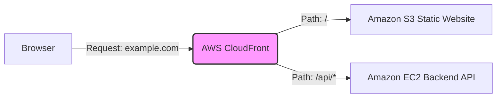

*(Label Source: Internet - Standard CloudFront Routing Architecture)*

**2. Practical Implementation: Multi-Tier VPC Creation**
The trainer demonstrated setting up a production-ready VPC from scratch.

* **Step 1: Create VPC**
* Navigate to AWS VPC console. Create a manual VPC named `main-project`.
* Assign IPv4 CIDR block: `10.0.0.0/16`.

* **Step 2: Create Subnets (8 Total)**
* Create **2 Public Subnets** (for Bastion Host, Load Balancers): `public-subnet-1` (us-west-2a, CIDR: `10.0.0.0/24`) and `public-subnet-2` (us-west-2b, CIDR `10.0.1.0/24`).
* Create **2 Private Frontend Subnets**: `frontend-private-subnet-1-2a` (`10.0.2.0/24`) and `frontend-private-subnet-2-2b` (`10.0.3.0/24`).
* Create **2 Private Backend Subnets**: `backend-subnet-1-2a` (`10.0.4.0/24`) and `backend-subnet-2-2b` (`10.0.5.0/24`).
* Create **2 Private DB Subnets**: `db-subnet-1-2a` (`10.0.6.0/24`) and `db-subnet-2-2b` (`10.0.7.0/24`).

* **Step 3: Internet Gateway (IGW) & NAT Gateway**
* Create an Internet Gateway (`project_ig`) and attach it to the `main-project` VPC.
* Create a NAT Gateway (`proj-nat`) to allow private subnets to access the internet. Place it in `public-subnet-1` and allocate an Elastic IP.

* **Step 4: Route Tables**
* **Public Route Table:** Create `project-pub-rt`. Add a route `0.0.0.0/0` pointing to the **Internet Gateway**. Associate the 2 Public Subnets.
* **Private Route Table:** Create `project-pvt-rt`. Add a route `0.0.0.0/0` pointing to the **NAT Gateway**. Associate the 6 Private Subnets (Frontend, Backend, DB).

* **Step 5: Security Groups (SG)**
* **DB SG:** Allow traffic (port 3306) only from the Backend SG.
* **Backend SG:** Allow custom TCP (e.g., port 5000) from the Frontend/CloudFront SG and SSH from the Bastion SG.
* **Frontend SG:** Allow HTTP/HTTPS (80/443).
* **Bastion SG:** Allow SSH (port 22) from your IP.

* **Step 6: RDS Database Setup**
* Create a DB Subnet Group selecting the VPC and the two specific DB subnets (`db-subnet-1-2a`, `db-subnet-2-2b`).
* Create an RDS MySQL (or MariaDB) database. Select Free Tier/DevTest.
* Set Master Username (`admin`) and Password. Disable public access. Attach the `project-db` Security Group.

* **Step 7: Launching EC2 Instances**
* **Bastion Host:** Launch in `public-subnet-1` (t2.micro), enable auto-assign public IP, attach Bastion SG, use your key pair.
* **Backend Server:** Launch in `backend-subnet-1-2a` (t2.medium recommended for compilation), disable auto-assign public IP, attach Backend SG, use the same key pair.

* **Step 8: Application Deployment**
* SSH into the Bastion host using its public IP.
* From the Bastion, SSH into the Backend server using its private IP (requires copying the `.pem` key to the Bastion securely).
* Install dependencies: `git`, `mariadb105-server` (MySQL client), `python3`, `pip`.
* Clone the project repository.
* Execute the `test.sql` file against the RDS endpoint to build the database schema: `mysql -h <rds-endpoint> -u admin -p < test.sql`.
* Update the backend `.env` file with the RDS endpoint, username, password, and port.
* Run the Python backend application (e.g., `python3 app.py` running on port 5000) and verify it connects to the database.

---

### Interview Questions Discussed by Trainer in Session

1. **Why can't Amazon S3 behave as a reverse proxy?**
* S3 is an object storage service designed strictly to serve static files (HTML, CSS, images) and perform basic routing redirects. It lacks the compute capabilities to process API requests, rewrite headers, or handle server-side request forwarding to a backend EC2 instance.

2. **How does the CloudFront reverse proxy solve CORS issues?**
* CORS (Cross-Origin Resource Sharing) occurs when a browser blocks a frontend (e.g., `frontend.s3.amazonaws.com`) from calling an API on a different domain (e.g., `api.mybackend.com`). CloudFront unifies both under one domain. The browser communicates only with CloudFront (`example.com`). CloudFront then internally routes `/` to S3 and `/api` to EC2, bypassing browser CORS restrictions completely.

3. **Why do we create dedicated subnets (Frontend, Backend, DB) instead of putting everything in one private subnet?**
* Creating dedicated subnets provides granular security control. It allows us to apply specific Network ACLs (NACLs) and Route Tables to different layers. For example, we can ensure the DB subnet only ever communicates with the Backend subnet, ensuring maximum isolation and security for data.

---

### L2 & L3 AWS Interview Questions (Sourced from Internet)

**1. What is the difference between an Edge Location and a Regional Edge Cache in CloudFront? (Asked at Amazon)**
**[IMPORTANT]**
**Answer:** An Edge Location is a small Point of Presence (PoP) located closest to the end-users, designed to cache content and deliver it with the lowest latency. A Regional Edge Cache is a larger, centralized caching layer that sits between the Edge Locations and your Origin server. If a file is requested and not found in the Edge Location, it checks the Regional Edge Cache before querying the origin, which significantly reduces the computational load on your origin server.

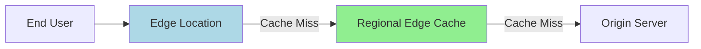

*(Label Source: Internet - CloudFront Caching Hierarchy)*

**2. How does CloudFront handle a "Cache Miss"? (Asked at Infosys)**
**Answer:** A cache miss occurs when a user requests a file that is not currently stored in the CloudFront cache or the file's TTL (Time-to-Live) has expired. When this happens, CloudFront forwards the request to the Origin (like an S3 bucket or EC2 instance) to fetch the file. Once the origin returns the file, CloudFront delivers it to the user and simultaneously saves a copy in the cache for future requests based on the configured caching behavior.

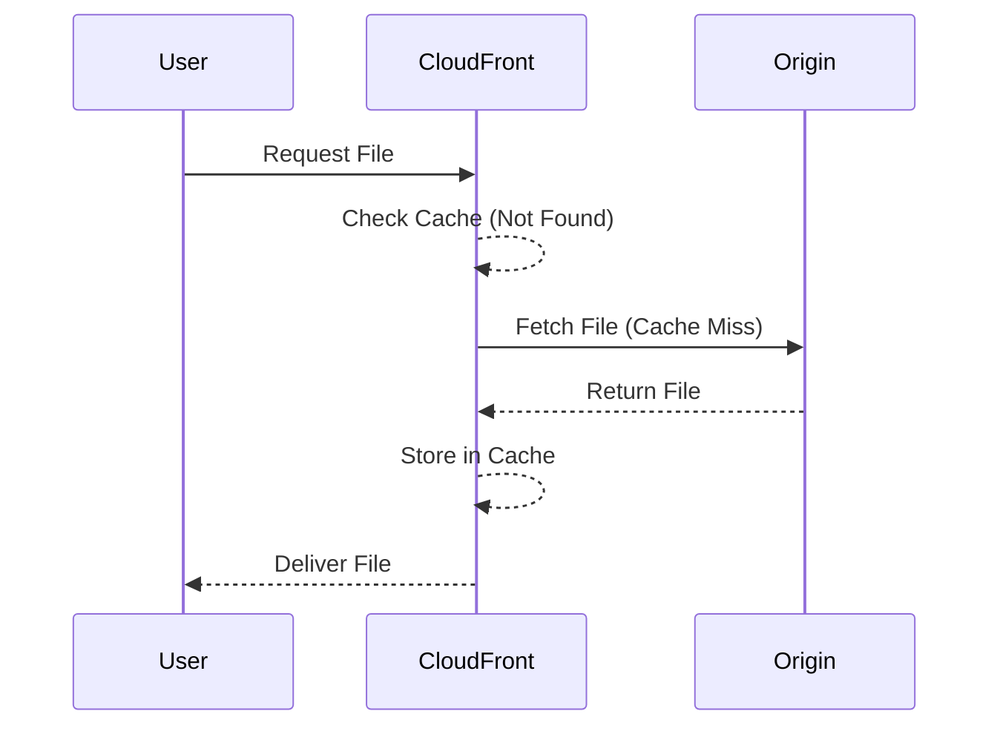

*(Label Source: Internet - Cache Miss Flow)*

**3. What is the difference between Amazon RDS and DynamoDB? (Asked at Wipro)**
**[IMPORTANT]**
**Answer:** Amazon RDS is a managed relational database service that uses structured data, predefined schemas, and supports complex SQL queries, relationships, and ACID compliance. It supports engines like MySQL, PostgreSQL, and Oracle. DynamoDB, on the other hand, is a fully managed NoSQL (key-value) database designed for unstructured data, flexible schemas, and highly scalable, single-digit millisecond latency workloads. RDS requires scaling configurations, whereas DynamoDB scales automatically.

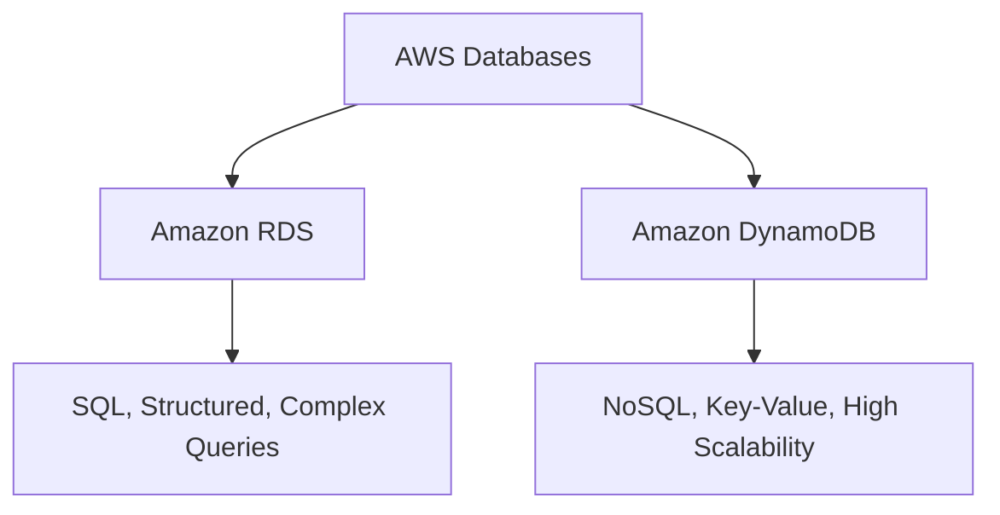

*(Label Source: Internet - RDS vs DynamoDB)*

**4. Differentiate between a Public Subnet and a Private Subnet in a VPC. (Asked at TCS)**
**Answer:** A public subnet has a route in its Route Table that directs internet-bound traffic (`0.0.0.0/0`) to an Internet Gateway, allowing resources within it to access the internet directly. A private subnet does not have a direct route to the Internet Gateway; instead, it routes internet-bound traffic through a NAT Gateway or NAT Instance located in the public subnet, ensuring the private instances remain secure and inaccessible from the outside internet.

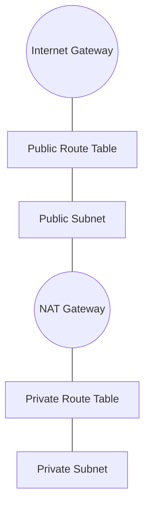

*(Label Source: Internet - VPC Subnet Routing)*

**5. Explain the concept of VPC Peering vs. AWS Transit Gateway. (Asked at Amazon L3)**
**[IMPORTANT]**
**Answer:** VPC Peering provides a simple, direct, one-to-one connection between two VPCs, allowing them to communicate using private IP addresses. However, peering connections are not transitive, meaning if you have many VPCs, you must create a complex mesh network. AWS Transit Gateway resolves this by acting as a central hub (a network transit router) that interconnects multiple VPCs and on-premises networks, vastly simplifying network architecture and management.

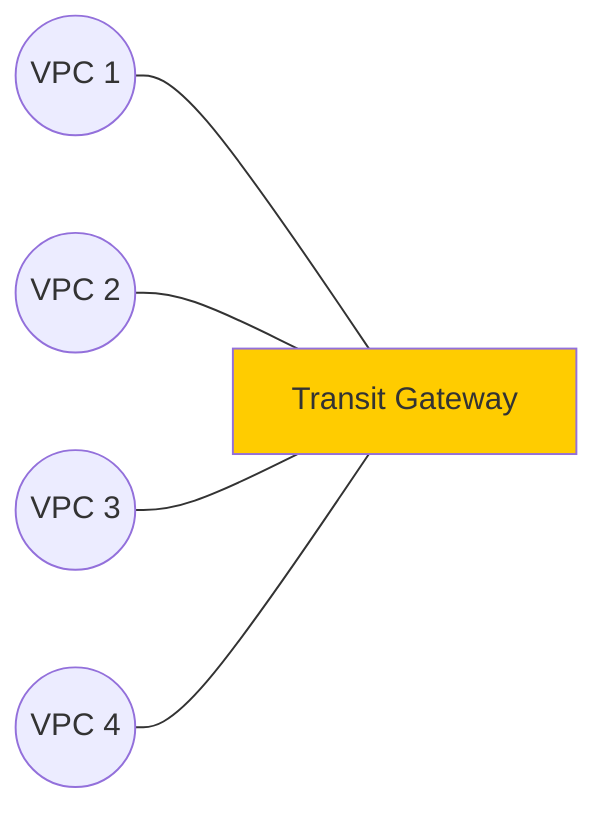

*(Label Source: Internet - Transit Gateway Hub and Spoke)*

**6. How do you secure an EC2 instance? (Asked at Infosys)**
**Answer:** EC2 instances are secured at multiple layers. First, at the network layer, Security Groups are used as stateful firewalls to restrict inbound and outbound traffic to specific IP addresses and ports. Network ACLs provide an additional stateless layer of defense at the subnet level. Secondly, Identity and Access Management (IAM) roles are assigned to the instance instead of embedding static access keys, ensuring the instance has the principle of least privilege to interact with other AWS services. Regular OS patching and monitoring using CloudWatch are also vital.

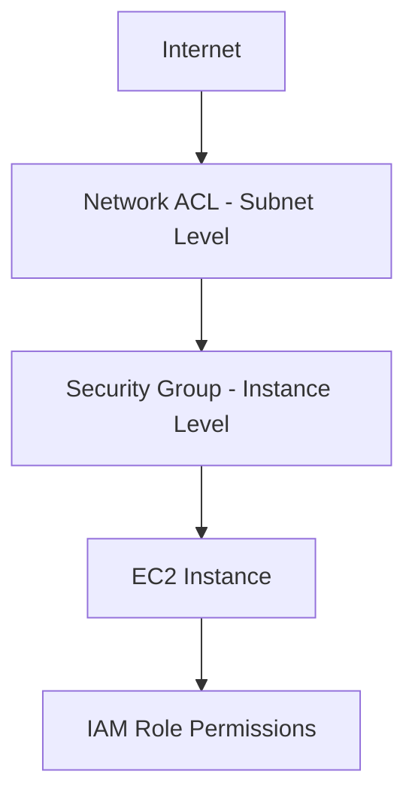

*(Label Source: Internet - EC2 Security Layers)*

**7. What is Origin Access Control (OAC) in CloudFront and why is it used? (Asked at Amazon)**
**[IMPORTANT]**
**Answer:** Origin Access Control (OAC) is the modern security mechanism used to restrict direct access to an Amazon S3 bucket so that the bucket contents can only be accessed through Amazon CloudFront. By configuring OAC in CloudFront and updating the S3 bucket policy to only allow the CloudFront Service Principal (`s3:GetObject`), any user attempting to access the S3 URL directly will receive a 403 Forbidden error, preventing users from bypassing the CDN caching and security layers.

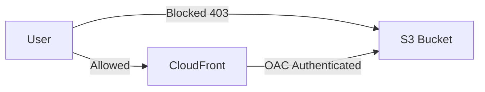

*(Label Source: Internet - CloudFront OAC Flow)*

**8. What is the difference between an Application Load Balancer (ALB) and a Network Load Balancer (NLB)? (Asked at Wipro)**
**Answer:** An Application Load Balancer (ALB) operates at Layer 7 (Application layer) of the OSI model. It is designed to handle HTTP/HTTPS traffic and supports advanced routing features like path-based or host-based routing (e.g., routing `/images` to one server and `/api` to another). A Network Load Balancer (NLB) operates at Layer 4 (Transport layer) and is designed for extreme performance and ultra-low latency, handling millions of TCP/UDP requests per second.

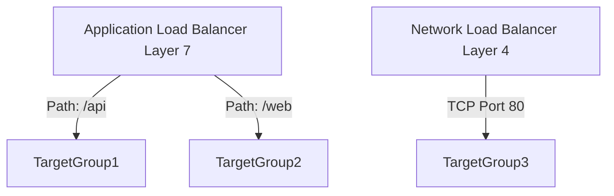

*(Label Source: Internet - ALB vs NLB Routing)*

**9. What happens if an Internet Gateway (IGW) is not attached to a VPC? (Asked at Infosys)**
**Answer:** If an Internet Gateway is not attached to a VPC, the VPC is entirely isolated from the public internet. No resources inside the VPC (even those in a designated "public" subnet with assigned public IPs) will be able to send outbound traffic to the internet, nor will they be able to receive inbound traffic from the internet. The IGW serves as the primary target in the VPC route table for internet-bound (`0.0.0.0/0`) traffic.

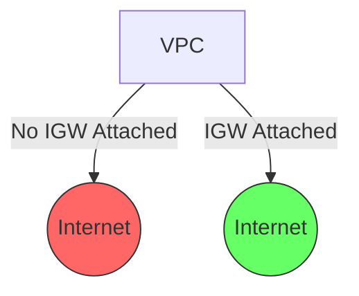

*(Label Source: Internet - Internet Gateway Connectivity)*

**10. What is the difference between stopping and terminating an EC2 instance? (Asked at Amazon)**
**Answer:** Stopping an EC2 instance initiates a normal shutdown of the operating system and pauses the virtual machine. While stopped, you do not pay for compute costs, but you still pay for the attached EBS volume storage, and the instance ID remains intact so it can be restarted later. Terminating an instance permanently deletes the virtual machine; the Instance ID is lost, and by default, the root EBS volume attached to the instance is deleted, meaning all data on it is permanently erased.

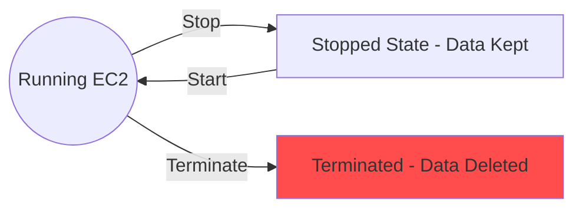

*(Label Source: Internet - EC2 Instance Lifecycle)*

---

### DevOps Architect Tips (20+ Years Industry Experience)

As a Senior DevOps Architect, here are my top 3 intelligent suggestions when implementing this architecture in a real-world enterprise environment:

1. **Implement Infrastructure as Code (IaC) Early:** Do not create a complex 8-subnet VPC, Route Tables, and NAT Gateways manually via the AWS Console for production. Use Terraform, AWS CloudFormation, or AWS CDK. Manual setups lead to "configuration drift," human errors (like selecting the wrong Availability Zone), and non-reproducible environments.
2. **Enforce Strict Security Group Chaining:** Never use CIDR blocks (e.g., `10.0.0.0/24`) in your Security Group inbound rules if you can avoid it. Instead, use "Security Group Chaining." Your RDS Security Group should *only* accept traffic from the `Backend-SG` ID. Your Backend SG should *only* accept traffic from the `Frontend-CloudFront-SG` ID. This ensures zero-trust architecture even if your internal network routing gets misconfigured.
3. **Optimize CloudFront TTL & Invalidation Logic:** Be highly strategic with your Cache headers. Static assets (images, CSS) should have long TTLs (e.g., 1 year) combined with file hashing (e.g., `app-v1.2.css`) so you never have to pay for slow, expensive CloudFront invalidations. Conversely, ensure your API Behavior (`/api/*`) in CloudFront is set to cache `0` (or `Managed-CachingOptimized` disabled) and forwards all necessary headers (Authorization, Host) to the EC2 backend so stateful sessions and authentication don't break.
