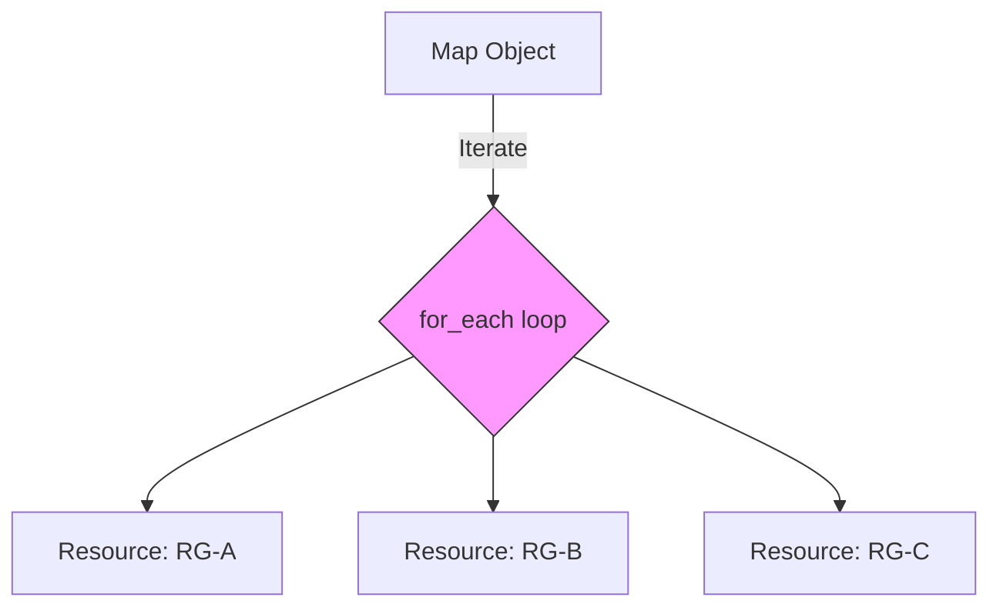
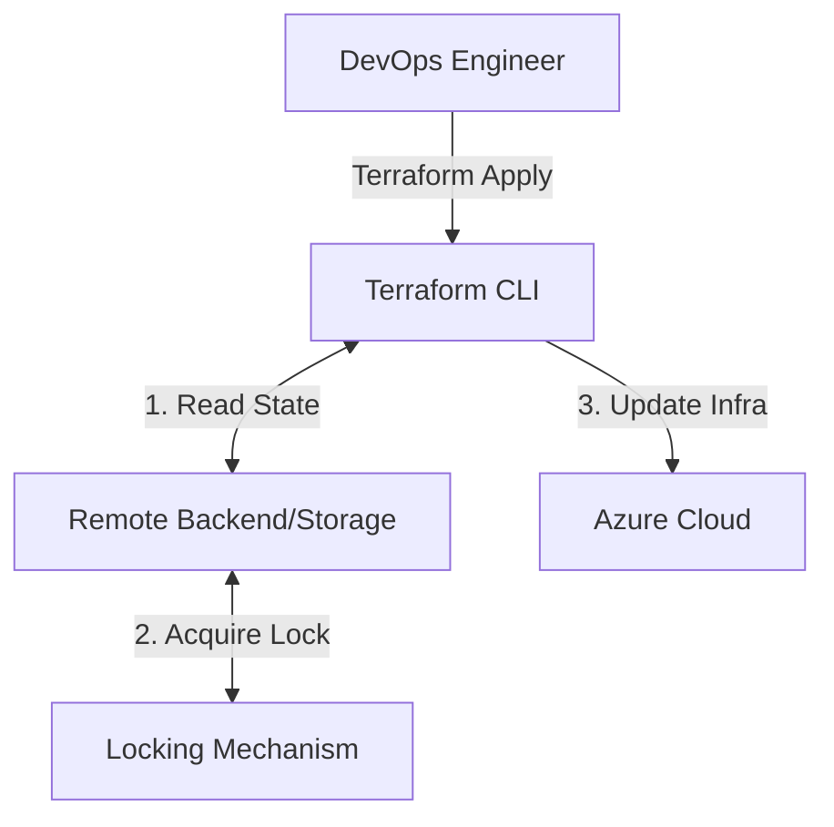
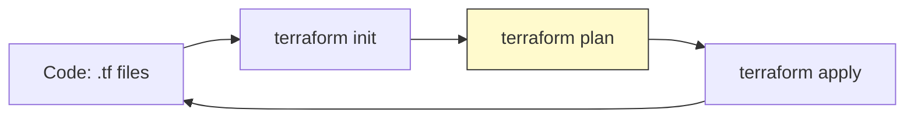
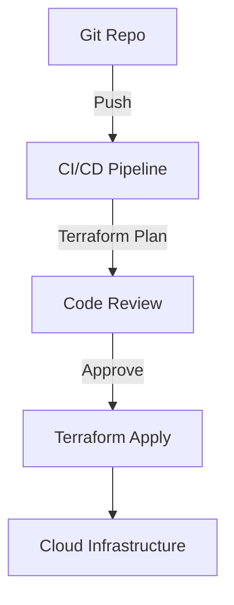
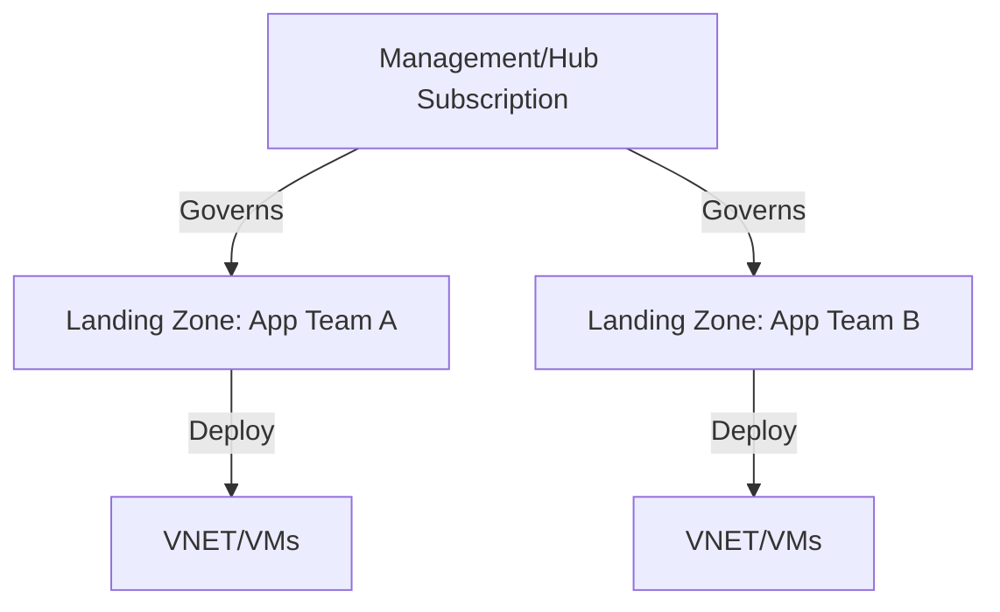

## Final Notes: Azure Landing Zone & Terraform Best Practices

---

### To-the-Point Summary

This document provides a comprehensive overview of advanced Terraform infrastructure patterns, specifically `for_each` with nested maps and infrastructure migration strategies, as discussed in the session "639 p1 azure landing zone 23.05.2026_21.06.38_REC.mp4". It details the technical implementation of scalable resource deployment, strategies for cloud migration, and career development advice for DevOps engineers.

---

## Detailed Notes

### 1. Terraform `for_each` and Nested Maps

The session emphasized using `for_each` over `count` to ensure resource uniqueness and consistency. When managing complex infrastructure, nested maps allow for structured, hierarchical configuration.

* **The Logic:** You create a parent map containing keys (representing the resource) and values (a sub-map containing attributes like `rg_name`, `location`, `tier`).
* **The Iteration:**
* The `for_each` loop iterates over the top-level keys.
* `each.key` corresponds to the unique identifier for the iteration.
* `each.value` provides access to the sub-map, allowing you to pull specific properties (e.g., `each.value.rg_name`).

* **Visualizing the Concept:**
* **Iteration 1:** Terraform processes the first key in the map, pulling specific attributes for that resource group and storage account, and creates the infrastructure in Azure.
* **Iteration 2:** The loop moves to the next key, repeating the creation process with the new set of parameters, ensuring no manual duplication of code.

### 2. Infrastructure Migration & Strategy

Migration projects are complex and require a structured approach to avoid downtime.

* **Landing Zone:** This is the baseline environment (VNETs, IAM policies, security, logging) that must be established before moving any production workload to the cloud.
* **Modernization:** Migration is not just a copy-paste job. The architect recommends an incremental approach:
* *Step 1:* Virtualization (Moving VMs to Cloud).
* *Step 2:* Modernization (Containerization using AKS or Serverless).

* **Risk Mitigation:** Never move everything at once. Use Load Balancers to shift traffic in small increments, allowing for immediate rollback if issues arise.

---

## Diagrams

### Diagram 1: Terraform `for_each` logic

*Source: Session 639 p1*

### Diagram 2: Remote State Backend

*Source: Internet*

### Diagram 3: Terraform Workflow Cycle

*Source: Internet*

### Diagram 4: CI/CD Integration

*Source: Internet*

### Diagram 5: Landing Zone Architecture

*Source: Internet*

---

## Interview Questions & Answers

### 1. How do you handle Terraform drift in production?

* **Answer:** Drift is handled by running automated `terraform plan` checks in the CI/CD pipeline. If the state file deviates from the actual cloud infrastructure, the pipeline flags it for reconciliation before any new code can be applied.

### 2. Compare `count` vs `for_each`.

* **Answer:** `count` relies on index order (0, 1, 2). Deleting an item shifts indices, causing unwanted resource recreation. `for_each` relies on map keys, ensuring that if you remove one element, the others remain untouched.

### 3. How to structure large-scale Terraform modules?

* **Answer:** Use a hierarchical structure: Root module -> Service module -> Resource module. Keep modules specialized to follow the DRY (Don't Repeat Yourself) principle.

### 4. What are the best practices for handling Terraform secrets?

* **Answer:** Never hardcode secrets. Use environment variables, secret management services (like Azure Key Vault or HashiCorp Vault), and `.tfvars` files that are ignored by Git.

### 5. What are the benefits of a "Landing Zone" approach?

* **Answer:** It ensures security, compliance, and networking standards are applied uniformly across all subscriptions, preventing "shadow IT" and configuration drift.

### 6. Explain `create_before_destroy`.

* **Answer:** A lifecycle rule that ensures the new resource is provisioned before the old one is decommissioned, minimizing downtime.

### 7. How do you handle circular dependencies in Terraform?

* **Answer:** Use `depends_on` as a last resort, but ideally refactor the code to break the circular reference by splitting the resource into separate modules.

### 8. What is the difference between `plan` and `apply`?

* **Answer:** `plan` generates a preview of changes (read-only); `apply` makes changes to the real-world infrastructure.

### 9. How do you manage infrastructure state in a team?

* **Answer:** Use a remote backend with state locking (e.g., Azure Storage with blob locks) to prevent concurrent writes.

### 10. How do you integrate Terraform into a CI/CD pipeline?

* **Answer:** The pipeline should automate `init`, `validate`, `plan`, and `apply` phases, using service principals to authenticate to the cloud provider.

---

## Tips from a DevOps Architect (20+ Years Experience)

1. **Prioritize "Immutable" Infrastructure:** Once deployed, avoid manual "tweaks." If a configuration needs changing, update the Terraform code and run a pipeline deployment. Manual changes are the enemy of stability.
2. **Master the State File:** The `.tfstate` file is the source of truth. Manage it with the same security as a production database. State corruption is a catastrophic failure that can take days to recover from if not properly backed up and version-controlled.
3. **Think in Services, Not Resources:** Don't just build VMs; build solutions. When designing your landing zones, think about how your network, security, and compute layers interact to provide a functional service to your business stakeholders. Your infrastructure should serve the business, not the other way around.
