---

# Docker & Kubernetes Masterclass: Complete Notes & Interview Guide

## 1. To-the-Point Summary

This session transitions from the challenges of managing isolated Docker containers to utilizing Kubernetes (K8s) as a robust, production-grade container orchestrator. It covers the necessity of automation for scaling, self-healing, and networking. The core concepts introduced include **Pods** (the smallest deployable units containing one or more containers, including Init and Sidecar containers), **Services** (stable networking and load balancing using label selectors), and **Namespaces** (logical cluster segregation). The session concludes with a deep dive into Kubernetes Architecture, detailing the separation of responsibilities between the **Control Plane** (Kube API Server, ETCD, Scheduler, Controller Manager) and **Worker Nodes** (Kubelet, Kube-proxy, Container Runtime Interface/CRI), and demonstrates how to interact with the cluster using `kubectl` and YAML configurations.

---

## 2. Detailed Masterclass Notes

### The Need for Orchestration

Managing a monolithic application is straightforward, but breaking it into microservices (Web App + Database) requires multiple containers.

* **The Problem:** If a container dies, you must manually restart it. If traffic spikes, you must manually scale (create new containers) and configure load balancing. Managing IPs, networking, and storage manually across multiple servers becomes a nightmare.
* **The Solution:** An Orchestrator. It automates scheduling, auto-scaling, networking, health checks, and lifecycle management based on a desired state configuration.
* *Orchestrator Options:* Docker Compose (not for production), Docker Swarm, OpenShift, EKS (Managed K8s), and **Kubernetes (K8s)** (the industry standard for production).

### Core Kubernetes Concepts

#### A. Pods

* **Definition:** In Kubernetes, you don't deploy containers directly; you deploy a **Pod**. A pod is a wrapper around one or more containers.
* **Container Types within a Pod:**
1. **Primary Container:** The main application (e.g., the Web App or Database).
2. **Init Container:** Runs before the primary container starts. It executes a script (like DB schema initialization) and must complete successfully before the pod continues.
3. **Sidecar Container:** Runs alongside the primary container to help it (e.g., a logging agent parsing logs generated by the primary web app).

* *Networking inside a Pod:* Containers inside the same pod communicate with each other via `localhost`.

#### B. Services & Networking

* **The Problem:** Pods are ephemeral. If a DB pod dies, K8s restarts it, but it gets a *new IP address*. Hardcoding IPs will break the application.
* **The Solution:** **Service**. A Service acts as a stable load balancer and DNS endpoint for a set of pods.
* **How it works:**
* You assign a `label` to your pods in the YAML (e.g., `app: db`).
* You create a Service and give it a `selector` matching that label (`app: db`).
* The Service automatically finds all pod IPs with that label, creates **Endpoints**, and routes traffic to them using a stable DNS name (e.g., `db.uat.svc.cluster.local`).

#### C. Namespaces

* **Definition:** Logical segregation within a single physical Kubernetes cluster.
* **Use Case:** Instead of buying two expensive clusters for UAT and Staging environments, you create two Namespaces (`staging` and `uat`). This isolates resources, allows you to set resource quotas (CPU/Memory limits per namespace), and apply network policies, saving significant infrastructure costs.

### Kubernetes Architecture

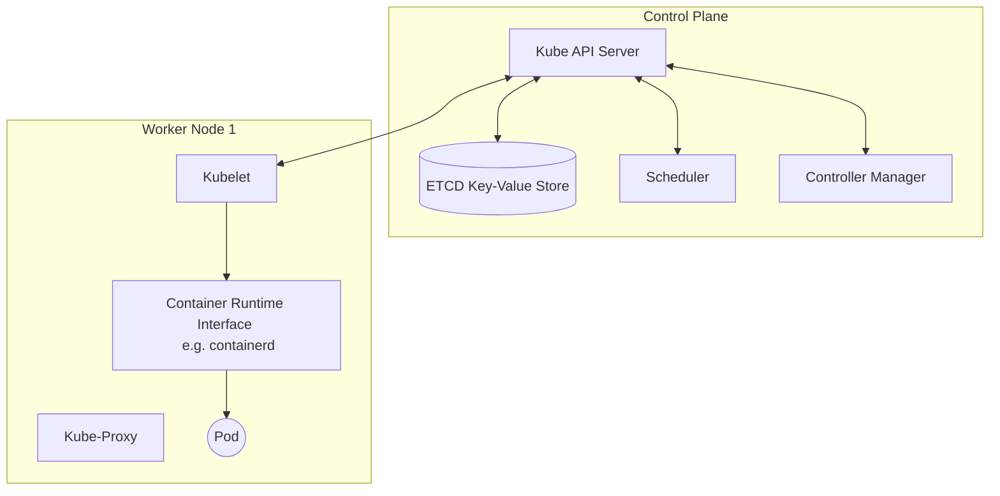

#### 1. The Control Plane (Master)

Maintains the desired state of the cluster.

* **Kube API Server:** The central communication hub. It exposes a REST API that accepts JSON payloads (usually converted from your YAML files). Handles authentication and authorization.
* **ETCD:** A highly available key-value store. It acts as the "brain" or database of K8s, storing all cluster data, state, and secrets.
* **Scheduler:** Watches for newly created Pods that have no assigned node, and selects a Worker Node for them to run on based on resource availability (CPU/Memory).
* **Controller Manager:** Continuously monitors the cluster (Current State) and makes changes to ensure it matches the Configuration (Desired State).

#### 2. Worker Nodes

The machines where your actual applications run.

* **Kubelet:** An agent running on every node. It talks to the API server, ensures containers described in PodSpecs are running and healthy.
* **Kube-Proxy:** Manages network rules on nodes. Allows network communication to your Pods from network sessions inside or outside of your cluster (implements Services).
* **Container Runtime Interface (CRI):** The software responsible for running containers. **Important Note:** K8s dropped direct support for Docker (DockerShim). It now uses CRI-compliant runtimes like `containerd` or `CRI-O`.

### Hands-on Configuration & Kubectl

* **YAML Structure:** Every K8s object requires 4 root keys:
1. `apiVersion`: (e.g., v1)
2. `kind`: (e.g., Pod, Service)
3. `metadata`: (name, labels)
4. `spec`: (container details, images, ports, selectors)

* **Kubectl:** The CLI tool to interact with K8s. It relies on a `kubeconfig` file (usually at `~/.kube/config`) which contains the API Server endpoint, certificates, and authentication details.
* *Commands shown:* `kubectl get pods`, `kubectl describe pod <name>`, `kubectl cluster-info`, `kubectl apply -f file.yaml`.

---

## 3. Interview Questions Discussed by Trainer

1. **Why do we use Kubernetes instead of Docker Compose for production?**
*Answer:* Docker Compose lacks production-grade orchestration features. It cannot self-heal (automatically restart pods on a different machine if a node dies), auto-scale based on traffic, or perform advanced cross-node scheduling.
2. **What happens when a Pod dies in Kubernetes?**
*Answer:* Kubernetes (specifically the Controller Manager and Kubelet) detects that the desired state does not match the actual state. It will schedule and spin up a new Pod to replace the dead one. The new pod will get a new IP address.
3. **Why do we need a "Service" object in Kubernetes?**
*Answer:* Because Pods are ephemeral and their IPs change upon recreation. A Service provides a stable, static IP and DNS name, acting as a load balancer that routes traffic to the underlying Pods using Label Selectors.
4. **What is an Init Container and when would you use it?**
*Answer:* An Init Container is a helper container within a Pod that runs and completes *before* the primary container starts. It is used for setup tasks, such as running a database migration script or waiting for a prerequisite service to become available.
5. **Why did Kubernetes deprecate Docker as its runtime?**
*Answer:* Kubernetes interacts with runtimes via the Container Runtime Interface (CRI). Docker itself wasn't CRI-compliant, requiring K8s to maintain a bridge called `dockershim`. K8s deprecated the shim to rely directly on lightweight, native CRI-compliant runtimes like `containerd` and `CRI-O`.

---

## 4. L2/L3 Interview Questions & Answers (Source: Internet)

*Note: The following advanced questions are frequently sourced from internet interview experiences at top tech companies. [Marked Important]*

**1. [Amazon] Explain how Kubernetes handles Split-Brain scenarios in its control plane.**
**[Important]**
*Answer:* Kubernetes relies on ETCD for state management. ETCD uses the Raft consensus algorithm. In a split-brain network partition, Raft requires a strict majority (quorum) to write data. If a cluster is split, the minority partition cannot achieve quorum and will reject writes, preventing data corruption. Once the network heals, the minority nodes sync missing logs from the leader.

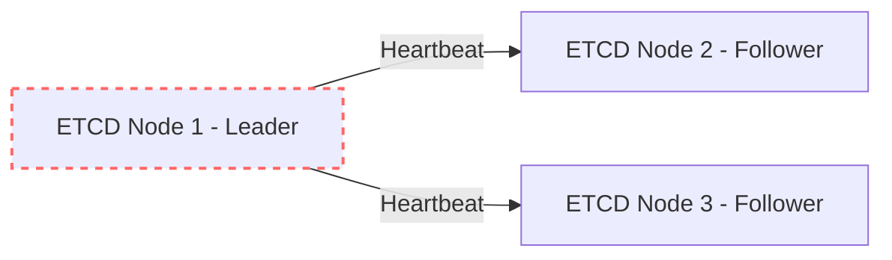

**2. [Microsoft] How does the Kubernetes network model (CNI) work, and what are its fundamental rules?**
*Answer:* The Container Network Interface (CNI) defines how pods communicate. The fundamental K8s networking rules are: 1) All pods can communicate with all other pods without NAT. 2) All nodes can communicate with all pods without NAT. 3) The IP a pod sees itself as is the same IP others see it as. Plugins like Calico, Flannel, or Cilium implement this by assigning IP subnets to nodes and configuring routing tables.

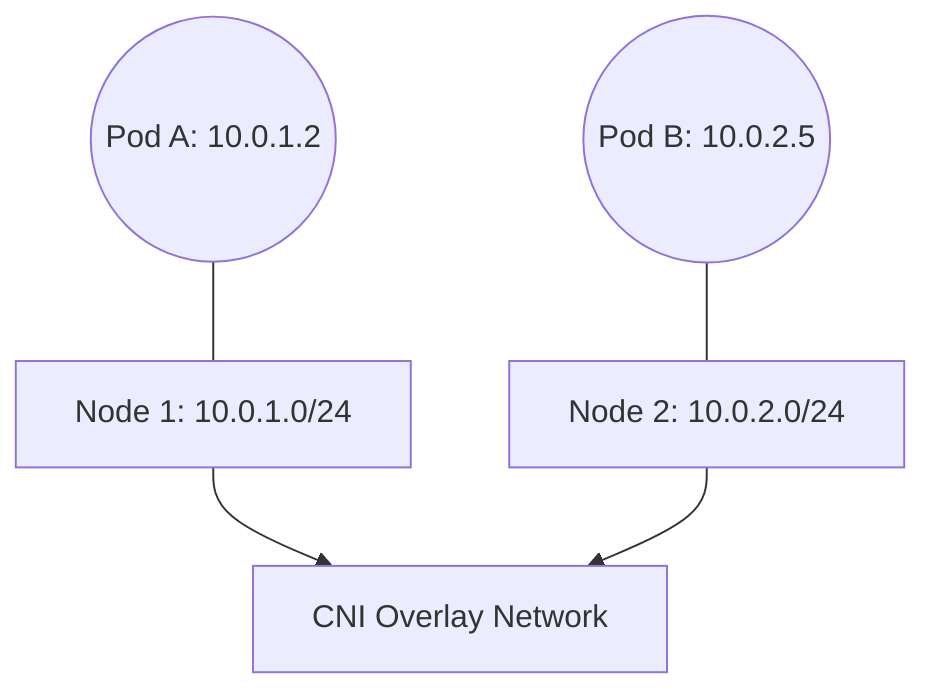

**3. [Google] Explain the difference between a Deployment, StatefulSet, and DaemonSet.**
**[Important]**
*Answer:*

* **Deployment:** For stateless apps. Pods are identical and interchangeable.
* **StatefulSet:** For stateful apps (like Databases). Pods get persistent, ordered identifiers (e.g., `db-0`, `db-1`) and stable storage that survives pod deletion.
* **DaemonSet:** Ensures that exactly one copy of a pod runs on *every* node in the cluster (used for log collectors or monitoring agents like Fluentd).

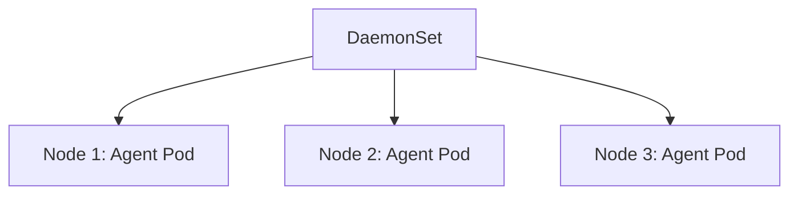

**4. [Netflix] How exactly does Kube-Proxy implement Services under the hood?**
*Answer:* Kube-Proxy watches the API server for changes to Services and Endpoints. By default, it operates in `iptables` mode (or `IPVS` for larger scale). It writes rules directly into the host machine's Linux `iptables`. When a packet hits the Node intended for a Service IP, the `iptables` rules trap the packet and dynamically translate the destination IP to a specific backend Pod IP using NAT.

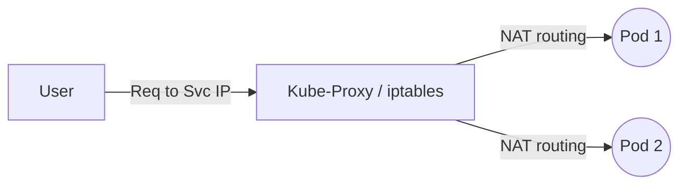

**5. [Walmart] How does the Horizontal Pod Autoscaler (HPA) function?**
*Answer:* HPA operates as a control loop. It periodically queries the Metrics Server to get CPU/Memory usage of pods in a Deployment. If the average utilization exceeds the target threshold (e.g., 80% CPU), the HPA updates the Deployment's `spec.replicas` field. The Controller Manager then spins up new pods to distribute the load.

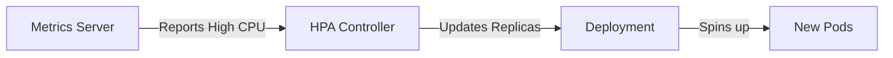

**6. [Oracle] How do you secure network traffic between pods in a namespace?**
**[Important]**
*Answer:* By default, all pods can talk to each other. To secure this, you implement **Network Policies**. Network Policies act as a firewall at the Pod level, allowing you to define Ingress (incoming) and Egress (outgoing) rules using label selectors (e.g., only pods with label `role: frontend` can access port 3306 on `role: backend`).

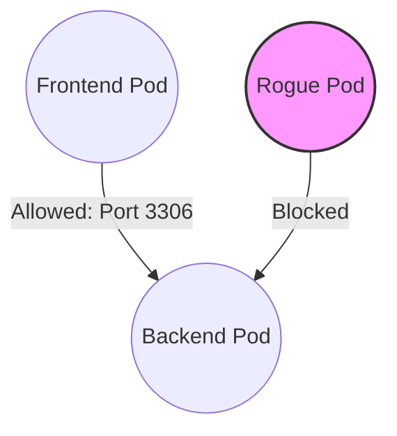

**7. [Cisco] What is the difference between NodePort, LoadBalancer, and Ingress?**
*Answer:*

* **NodePort:** Opens a specific static port (30000-32767) on every node's IP to route external traffic to the service.
* **LoadBalancer:** Provisions a cloud-provider load balancer (like AWS ALB) that points to the NodePorts.
* **Ingress:** Operates at Layer 7 (HTTP/HTTPS). It is not a Service type, but an API object that routes traffic based on URL paths or hostnames to internal Services, requiring an Ingress Controller (like Nginx) to function.

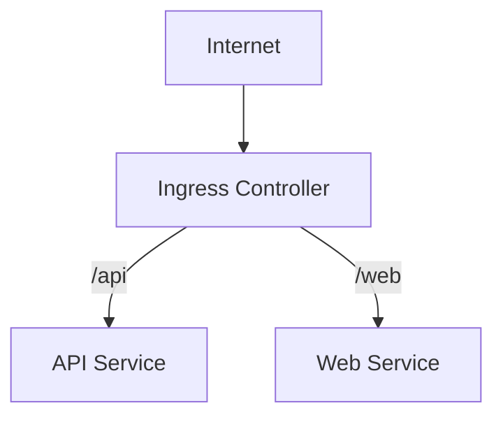

**8. [IBM] Explain a Rolling Update strategy in Kubernetes and how to achieve zero-downtime.**
*Answer:* A rolling update is the default deployment strategy. K8s gradually replaces old pods with new ones. To ensure zero downtime, you must configure `maxUnavailable` (ensuring enough old pods keep running) and `maxSurge` (allowing temporary over-provisioning). Additionally, you *must* implement Readiness Probes so K8s only sends traffic to the new pods once they are actually ready to accept HTTP connections.

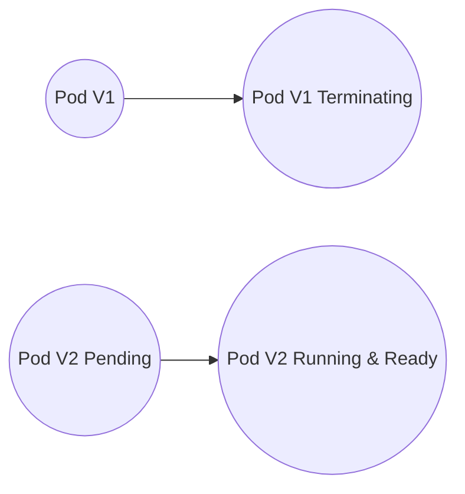

**9. [TCS] What are Taints, Tolerations, and Node Affinity?**
**[Important]**
*Answer:* They control pod scheduling.

* **Taints & Tolerations:** A Taint is applied to a Node to *repel* pods (e.g., `gpu=true:NoSchedule`). A Pod will only be scheduled there if it has a matching Toleration.
* **Node Affinity:** Applied to a Pod to *attract* it to specific nodes based on node labels (e.g., strictly run this pod on nodes labeled `disktype=ssd`).

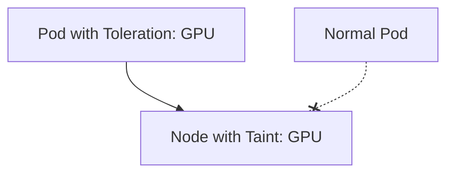

**10. [Uber] How do you handle secrets management in Kubernetes securely?**
*Answer:* Native K8s Secrets are only base64 encoded, not encrypted by default. For enterprise L3 setups, you must: 1) Enable Encryption at Rest in ETCD. 2) Use external secret managers like HashiCorp Vault or AWS Secrets Manager. 3) Inject secrets dynamically using CSI drivers or sidecar patterns rather than storing them in environment variables.

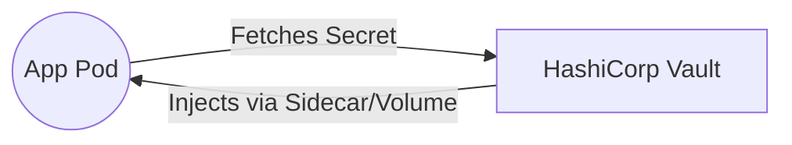

---

## 5. Tips from a DevOps Architect (20+ Years Experience)

As an architect designing distributed systems at scale, here are my top 3 intelligent suggestions for mastering Kubernetes:

1. **Adopt GitOps & Infrastructure as Code (IaC) strictly:** Never run `kubectl apply` manually in production. Use tools like **ArgoCD** or **FluxCD**. Your Git repository should be the single source of truth for your cluster's desired state. This guarantees auditability, immediate rollbacks, and disaster recovery.
2. **Shift-Left your Kubernetes Security:** Do not treat security as an afterthought. Implement **OPA Gatekeeper** or **Kyverno** to enforce policies at the API server level before objects are even created. Disallow containers running as `root`, enforce read-only filesystems, and strictly define Network Policies using a default-deny approach.
3. **Proactive Observability over Reactive Monitoring:** Distributed systems *will* fail. Standard CPU/Memory metrics are not enough. Implement deep observability using **Prometheus, Grafana, and OpenTelemetry**. Ensure you have distributed tracing in place for your microservices; otherwise, when a pod crashes in a chain of 10 services, finding the root cause will take days instead of minutes.
