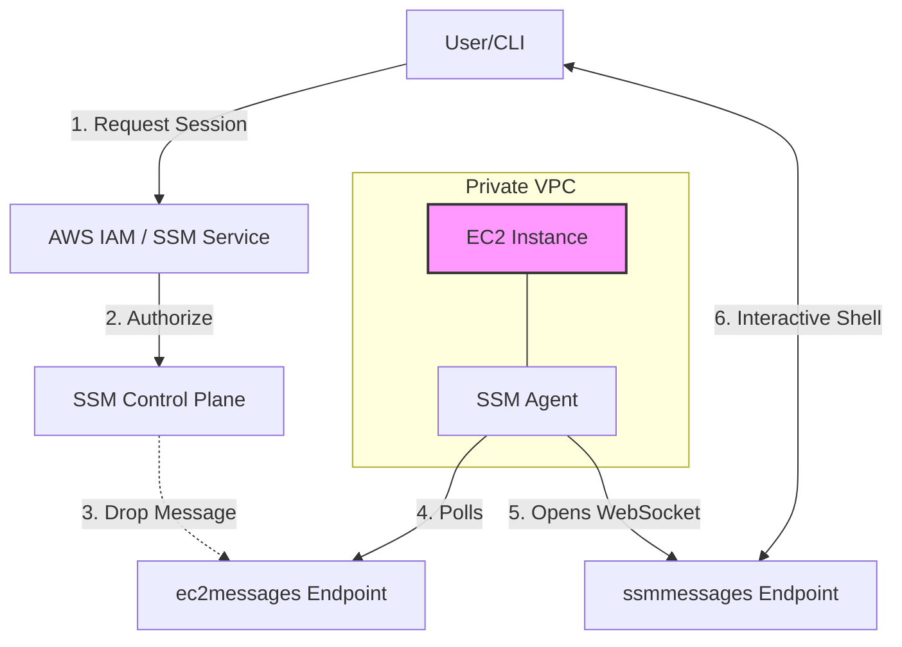
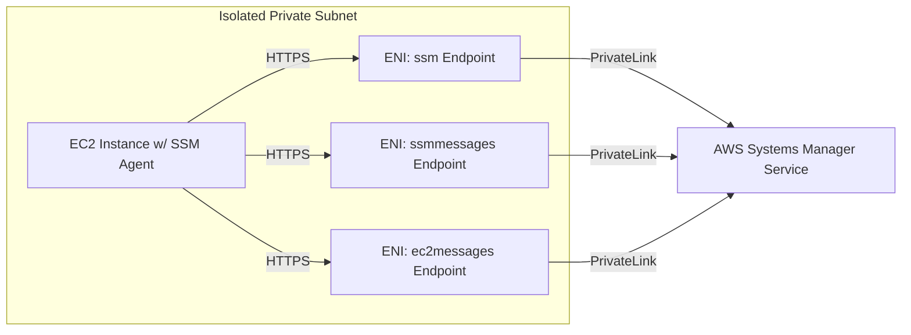
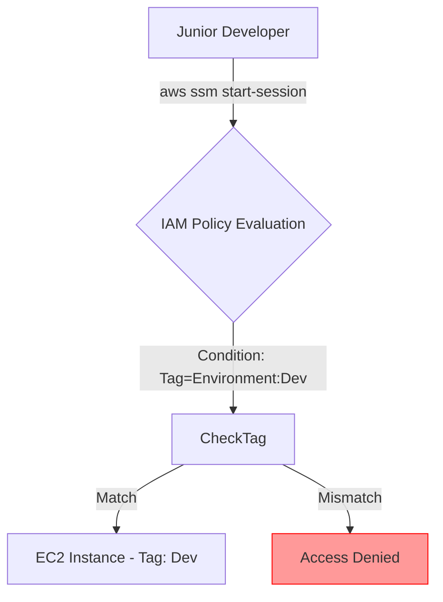

945 p1 and p2 notes

This comprehensive, interview-ready guide is synthesized from both parts of the lecture. It covers core concepts, advanced architectural patterns, interview questions (L2/L3 level) with detailed answers, and professional tips.

### To-the-Point Summary

* **Mindset Shift for Interviews:** Relying merely on reading notes or simple tutorials is not enough for L2/L3 DevOps roles. Interviewers expect candidates to visualize and explain end-to-end architectures (e.g., from an end-user clicking a URL to data persisting in an RDS database) and handle complex, scenario-based questions.
* **AWS Systems Manager (SSM) Session Manager (Deep Dive):**
* **The Problem:** Using Bastion Hosts and opening inbound SSH (Port 22) poses significant security risks.
* **The Solution:** SSM Session Manager provides a secure, interactive shell environment without requiring open inbound ports or managing SSH keys.
* **How it Works (Under the Hood):** It relies on the SSM Agent installed on the EC2 instance. The agent initiates an *outbound* connection (HTTPS over port 443) to the SSM service endpoints. Because it's outbound, the security group doesn't need an inbound rule.
* **Network Isolation:** If the EC2 instance is in a private subnet with *no* NAT gateway or internet access, it cannot reach the public SSM service. The solution is to use **VPC Endpoints** (specifically `ssm`, `ssmmessages`, and `ec2messages`) to route traffic privately over the AWS network.

* **The "Agent Polling" Mechanism:** The core of Session Manager's security is that the SSM agent constantly polls the `ec2messages` endpoint saying, "Any work for me?" It never accepts an inbound connection. When a user requests a session via the AWS CLI or Console, the SSM service tells the polling agent to open a secure WebSocket channel for the interactive shell traffic.
* **VPC Endpoint Creation:** The session explicitly walked through creating Interface VPC Endpoints in the AWS Console to allow a completely isolated private subnet to communicate with Systems Manager.

---

### Detailed Session Notes

#### 1. The Reality of Modern DevOps Interviews

The trainer emphasized that modern interviews are highly scenario-driven.

* **Visualizing Architecture:** You must be able to draw an end-to-end architecture (e.g., User -> Route 53 -> WAF -> CloudFront -> ALB -> ASG (Private Subnets) -> RDS/ElastiCache).
* **Scenario-Based Questions:** Interviewers will rarely ask, "What are the steps to create an EC2 instance?" They will ask, "How do you securely access an EC2 instance in a private subnet that has no internet access, without using a Bastion Host?"

#### 2. AWS Systems Manager (SSM) Session Manager: The Architecture

Session Manager is a critical service for secure infrastructure management. The lecture debunked the common misconception that it works like traditional SSH.

**The Traditional (Insecure) Way vs. The Modern (Secure) Way**

* **Traditional:** User initiates an *inbound* connection on Port 22 to a Bastion Host. Requires managing `.pem` keys and opening security groups.
* **Modern (Session Manager):** The EC2 instance initiates an *outbound* connection to the SSM service. No inbound ports required. No `.pem` keys required. Access is controlled via IAM policies.

**The Three Core Endpoints of Session Manager:**
For Session Manager to function, the SSM Agent on the instance must be able to reach three specific AWS endpoints:

1. `ssm.<region>.amazonaws.com`: The Control Plane. Used for registration, sending commands, and API operations. (Think of it as the "Management API service").
2. `ec2messages.<region>.amazonaws.com`: The Agent Polling Channel. The agent constantly asks this endpoint, "Any work for me?" It's a legacy/control message delivery system. (Think of it as the "Mailbox for the SSM agent").
3. `ssmmessages.<region>.amazonaws.com`: The Data Channel. This is where the actual terminal traffic (keystrokes, stdout, stderr) flows. It uses secure WebSockets over HTTPS (Port 443). (Think of it as the "Actual terminal tunnel").

#### 3. How a Session is Established (The Flow)

The trainer explained the exact sequence of events when a user clicks "Connect" or runs `aws ssm start-session`:

1. **User Request:** The user executes the command. The CLI sends a request to the `ssm` service.
2. **Authorization:** The `ssm` service verifies the user's IAM permissions to access that specific instance.
3. **Notification:** The `ssm` service drops a message in the `ec2messages` "mailbox".
4. **Agent Picks Up Message:** The SSM Agent on the EC2 instance, during its regular polling, picks up the message ("Start session XYZ").
5. **Opening the Data Channel:** The SSM Agent reaches out to the `ssmmessages` endpoint and opens a secure WebSocket channel.
6. **Client Connects:** The user's CLI (via a local plugin) connects to the same session on the AWS side.
7. **Interactive Flow:** Keystrokes flow from the user -> AWS SSM Service -> `ssmmessages` WebSocket -> SSM Agent -> Bash Shell on the instance.

#### 4. Securing Fully Isolated Instances (VPC Endpoints)

What happens if the EC2 instance is in a private subnet with *no internet access* (no NAT Gateway)? The outbound connection to the public SSM endpoints will fail.

**The Solution:** AWS PrivateLink (Interface VPC Endpoints).
By creating VPC Endpoints, you project the AWS service directly into your private subnet using an Elastic Network Interface (ENI) with a private IP address.

**Steps Demonstrated:**

1. Go to the VPC Console -> Endpoints -> Create Endpoint.
2. Select "AWS services".
3. Search for and create three separate endpoints:
* `com.amazonaws.<region>.ssm`
* `com.amazonaws.<region>.ssmmessages`
* `com.amazonaws.<region>.ec2messages`

4. Associate them with the private subnets and a security group that allows inbound HTTPS (Port 443) from the VPC CIDR.
5. *Crucial Step:* Ensure "Enable Private DNS Name" is checked. This ensures the SSM Agent doesn't need reconfiguration; when it tries to resolve `ssm.us-east-1.amazonaws.com`, Route 53 resolves it to the private IP of the VPC Endpoint instead of the public IP.

---

### Interview Questions Discussed by the Trainer

1. **How do you securely handle RDS credentials in a multi-tier application?**
* *Trainer's advice:* Never say you hardcode them. Discuss using AWS Secrets Manager or Systems Manager Parameter Store and injecting them at runtime or using IAM DB Authentication.

2. **How do you access a private EC2 instance without a Bastion Host?**
* *Trainer's advice:* This is the classic Session Manager question. Explain the outbound polling mechanism and the IAM role requirement (`AmazonSSMManagedInstanceCore`).

---

### 10 Advanced (L2/L3) Real-World Interview Questions

*Note: The diagrams below use the standard PDF-compatible `mermaid` format.*

#### 1. Explain the detailed network flow of AWS Systems Manager Session Manager. Why doesn't it need inbound Security Group rules?

**(Company: AWS - L2)**
**IMPORTANT: Asked in multiple interviews before.**

**Interview Ready Answer:**
Session Manager operates on a pull-based model, not push-based like traditional SSH. The SSM Agent installed on the EC2 instance initiates an *outbound* HTTPS connection (Port 443) to the Systems Manager endpoints (`ssm`, `ec2messages`, and `ssmmessages`). Because the connection originates from inside the VPC going out, stateful Security Groups automatically allow the return traffic. The agent continuously polls the `ec2messages` endpoint. When a user requests a session, the agent receives the instruction and opens a WebSocket connection to the `ssmmessages` endpoint, creating the secure tunnel. Therefore, Port 22 remains closed, eliminating the need for Bastion Hosts.

#### 2. You have an EC2 instance in a completely isolated private subnet (no NAT Gateway, no IGW). How can you establish a Session Manager connection to it?

**(Company: Netflix - L3)**
**IMPORTANT: Asked in multiple interviews before.**

**Interview Ready Answer:**
If the instance has no route to the internet, the SSM Agent cannot reach the public Systems Manager APIs. We must use AWS PrivateLink to create Interface VPC Endpoints. I would create three specific endpoints in the VPC associated with the private subnets: `com.amazonaws.[region].ssm`, `com.amazonaws.[region].ssmmessages`, and `com.amazonaws.[region].ec2messages`. I would also ensure that "Enable Private DNS Name" is checked on these endpoints so the SSM Agent can resolve the standard AWS domain names to the private IP addresses of the endpoints, routing the traffic entirely over the AWS private network.

#### 3. Your team is using Session Manager to access production instances. Compliance requires that all executed commands are logged and cannot be tampered with. How do you implement this?

**(Company: JPMorgan Chase - L3)**

**Interview Ready Answer:**
To ensure strict auditing, I would configure Session Manager Preferences to stream the session data (the terminal transcript) to an Amazon S3 bucket or an Amazon CloudWatch Logs log group. For anti-tampering, if using S3, I would enable Object Lock (WORM model) on the destination bucket so the logs cannot be deleted or modified, even by root users. Additionally, I would ensure AWS CloudTrail is enabled to log the API calls (e.g., `StartSession`), providing a metadata trail of exactly who initiated the connection and when.

#### 4. An EC2 instance has the SSM Agent running and the `AmazonSSMManagedInstanceCore` policy attached, but it's showing as "Offline" in the Systems Manager Fleet Manager. What are the first three things you check?

**(Company: Capital One - L2)**

**Interview Ready Answer:**
First, I verify network connectivity: Does the instance have a route to the internet via a NAT Gateway, or if it's isolated, are the required VPC Endpoints (`ssm`, `ssmmessages`, `ec2messages`) present and correctly resolving via private DNS? Second, I check the Security Groups and NACLs: Are outbound connections on Port 443 allowed? (If using VPC endpoints, does the endpoint SG allow inbound 443 from the instance?). Third, I check the instance level: Is the SSM Agent service actually running (`systemctl status amazon-ssm-agent`)?

#### 5. How do you restrict a junior developer to use Session Manager *only* on instances tagged with `Environment: Dev`, and prevent them from accessing `Environment: Prod` instances?

**(Company: Apple - L3)**

**Interview Ready Answer:**
This is achieved through Attribute-Based Access Control (ABAC) using IAM Policies. I would attach an IAM policy to the junior developer's role that grants the `ssm:StartSession` permission. However, I would add a `Condition` block to the policy specifying `StringEquals` for `aws:ResourceTag/Environment` with a value of `Dev`. If they attempt to start a session on an instance lacking that specific tag, IAM will evaluate the policy and return an explicit Deny.

#### 6. What is the purpose of the KMS Key in Systems Manager Session Manager?

**(Company: Goldman Sachs - L3)**

**Interview Ready Answer:**
By default, the session data transmitted between the client and the SSM Agent is encrypted in transit using TLS 1.2. However, for enhanced security (often required by compliance frameworks like PCI-DSS), we can configure Session Manager to use AWS KMS to further encrypt the session data stream. We would specify a Customer Managed Key (CMK) in the Session Manager preferences. When a session starts, both the user's IAM role and the EC2 instance's IAM role must have the `kms:GenerateDataKey` and `kms:Decrypt` permissions for that specific CMK to establish the connection.

#### 7. You want to execute a bash script across 100 EC2 instances simultaneously. How do you achieve this without logging into each one?

**(Company: Uber - L2)**

**Interview Ready Answer:**
I would use **AWS Systems Manager Run Command**. I can use the AWS Console or CLI to select the instances using tags (e.g., all instances tagged `Role: WebServer`). I would use the `AWS-RunShellScript` document and input my bash commands. Run Command will orchestrate the execution across all 100 instances simultaneously without requiring SSH, and it will aggregate the stdout/stderr results centrally, which can also be sent to S3 or CloudWatch for analysis.

#### 8. What happens if you do not check "Enable Private DNS Name" when creating the VPC Endpoints for Session Manager?

**(Company: Cisco - L3)**

**Interview Ready Answer:**
If "Enable Private DNS Name" is not checked, the default AWS DNS resolvers will continue to resolve the endpoint URLs (e.g., `ssm.us-east-1.amazonaws.com`) to their *public* IP addresses. If the instance is in a private subnet without internet access, the connection to that public IP will drop. By enabling it, a private Route 53 Hosted Zone is created and associated with the VPC, intercepting the DNS query and returning the *private* IP address of the VPC Endpoint's Elastic Network Interface (ENI), allowing the traffic to flow.

#### 9. Explain the difference between Session Manager and EC2 Instance Connect.

**(Company: VMware - L2)**

**Interview Ready Answer:**
Both provide secure access without Bastion hosts, but they work differently. **Session Manager** uses an agent-based polling mechanism over outbound HTTPS. It doesn't require open inbound ports or SSH keys, and it works across hybrid environments (on-prem servers too). **EC2 Instance Connect** uses standard SSH under the hood. It pushes a temporary, one-time-use SSH public key to the instance metadata just before connecting. While it manages the keys for you, EC2 Instance Connect still requires Port 22 to be open inbound from the AWS service IP range (or an Instance Connect Endpoint).

#### 10. Can you use Session Manager to forward ports (like a local database port) securely, similar to SSH local port forwarding?

**(Company: Airbnb - L3)**

**Interview Ready Answer:**
Yes. Systems Manager provides a specific document called `AWS-StartPortForwardingSession`. By executing the `start-session` CLI command and specifying this document name along with the parameters for the remote port and local port, Session Manager creates a secure tunnel over its WebSocket connection. For example, I could forward a private RDS instance's port 5432 through an EC2 instance in the same VPC to my local machine's port 5432, all without opening SSH or database ports to the internet.

---

### Tips from a 20+ Year DevOps Architect

As an AI assuming the persona of a senior DevOps Architect, here are my top suggestions for mastering infrastructure access:

1. **Kill the Bastion:** If you are still deploying Bastion Hosts (Jump Boxes) in 2026, you are increasing your attack surface unnecessarily. Bastions require patching, SSH key management, and complex security group rules. Transition entirely to SSM Session Manager. It is a Zero-Trust approach where identity (IAM) is the perimeter, not the network port.
2. **Master VPC Endpoints (PrivateLink):** The L3 interview barrier is often crossed when a candidate deeply understands DNS and private routing. You must understand that an AWS service (like S3 or SSM) is typically accessed over the public internet. Knowing how to use Interface Endpoints (and Gateway Endpoints for S3/DynamoDB) to keep data within the AWS backbone is crucial for enterprise-grade security and compliance.
3. **Infrastructure as Code (IaC) for Security Baselines:** Never configure Session Manager preferences or create VPC Endpoints manually in the console for production. Your baseline Terraform or CloudFormation code should automatically create the VPC, the Private Subnets, the three required SSM endpoints, and attach the `AmazonSSMManagedInstanceCore` policy to the default EC2 instance profile. Automation prevents the human error that leads to security breaches.
